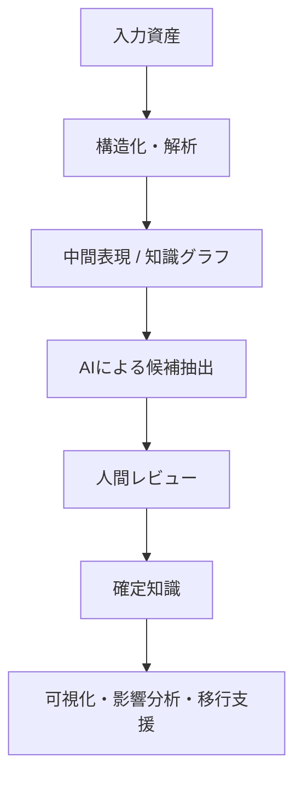
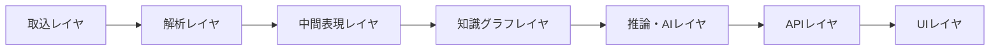
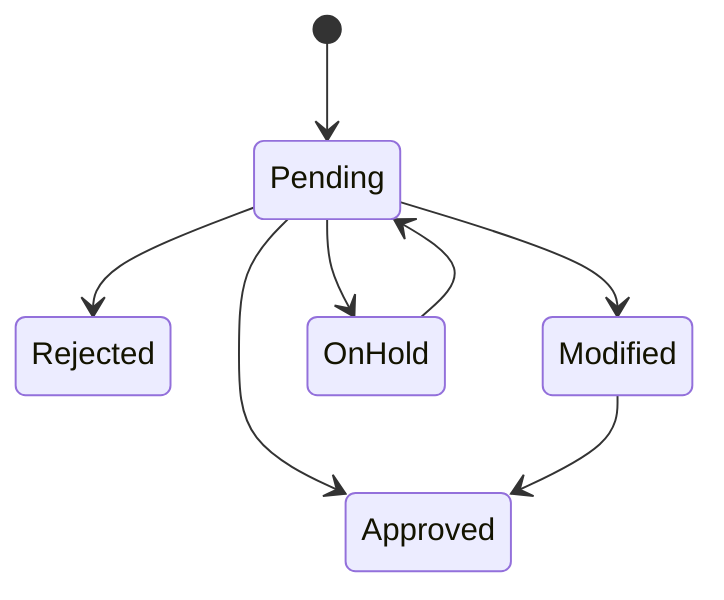

# レガシーコード考古学 実装ルール規定

- 文書名：レガシーコード考古学 実装ルール規定
- 文書番号：LCA-RULE-001
- 版数：1.0
- 作成日：2026-07-18
- 目的：本システムの実装において、設計判断、コード品質、AI利用、データ管理、レビュー、セキュリティ、運用の一貫性を担保する

---

## 1. 基本方針

本システムは、単なるコード変換ツールではなく、**失われた業務知識を証拠付きで復元するプラットフォーム**である。  
したがって、実装においては以下を最優先原則とする。

1. **証拠なき推論を採用しない**
2. **可視化より先に構造化を行う**
3. **AI出力を正として扱わない**
4. **技術依存の解析結果と業務知識を分離する**
5. **人間レビュー可能な形で保持する**
6. **差分再解析と監査可能性を前提とする**



---

## 2. 実装原則

### 2.1 Evidence First 原則

- すべての抽出結果、推論結果、分類結果には根拠を紐付けること
- 根拠は最低でも以下のいずれかを持つこと
  - ソースコード位置
  - SQL断片
  - 設定ファイル
  - 設計書断片
  - ログ断片
  - テストケース
  - Git履歴
  - レビューコメント
- 根拠を持たない知識は `Inferred` または `Unknown` として扱うこと
- `Confirmed` は自動付与してはならず、明示条件を満たす場合のみ付与すること

### 2.2 中間モデル中心原則

- 解析器は直接UI向けデータを生成してはならない
- 解析器は必ず**中間表現（IR: Intermediate Representation）**を生成すること
- UI、レポート、影響分析、知識抽出はIRまたは知識グラフを参照すること
- 言語別実装はIRへの変換責務までを境界とすること

### 2.3 Human in the Loop 原則

- 業務ルール、業務機能、例外条件の最終確定は人間レビューを経ること
- AI候補は「候補」であり、「真実」ではない
- レビューなしで確定状態へ昇格させてはならない
- 却下・修正・保留の状態管理を必須とすること

### 2.4 差分再解析原則

- フル再解析前提の設計を避けること
- ファイル単位、モジュール単位、依存単位で差分再解析可能にすること
- 再解析時には旧結果との差分比較を保持すること
- 変更前後の知識状態が追跡できること

### 2.5 技術非依存知識原則

- Java固有構文、Camel固有構文、SQL固有構文のまま業務知識を表現しないこと
- 業務知識層では、技術要素ではなく意味要素で表現すること
- ただし、技術要素とのトレースリンクは必ず保持すること

---

## 3. アーキテクチャ実装ルール

### 3.1 レイヤ分離

以下のレイヤを厳密に分離すること。

1. 取込レイヤ
2. 解析レイヤ
3. 中間表現レイヤ
4. 知識グラフレイヤ
5. 推論・AIレイヤ
6. APIレイヤ
7. UIレイヤ



#### 禁止事項

- UIから解析器内部実装へ直接アクセスすること
- AIレイヤが直接ソースファイルストレージを走査すること
- 解析結果をAPI専用DTOにだけ保持すること
- レイヤをまたいだ循環依存を作ること

### 3.2 非同期処理原則

以下は非同期ジョブ化すること。

- 大量取込
- 静的解析
- 文書解析
- ログ解析
- LLM推論
- 再解析
- レポート出力

#### ルール

- 同期APIはジョブ受付までとする
- ジョブには `jobId` を付与する
- ジョブ状態は `Queued / Running / Succeeded / Failed / Partial` を持つこと
- 冪等性を考慮すること

### 3.3 ストレージ責務分離

### 3.4 シェル実行環境初期化原則

- Shell コマンド実行前には、原則として `source ~/.bash_profile` を実行して環境変数・PATH を初期化すること
- `oc`, `java`, `node`, `python`, `podman` など利用ツールがログインシェル依存で利用可能になる環境を前提にする場合、この初期化を省略してはならない
- 自動化スクリプトでは、必要に応じて `bash -lc` または `source ~/.bash_profile && <command>` 形式を採用すること
- 実行失敗時は、コマンド自体の失敗と環境初期化漏れを区別して記録すること


- 原資料は原資料ストアへ保存する
- 中間解析結果はIRストアへ保存する
- 関係性知識は知識グラフへ保存する
- 管理情報はRDBへ保存する
- 意味検索用埋め込みはVector DBへ保存する

#### 禁止事項

- すべてをRDBだけで持とうとすること
- 監査ログを業務テーブルに混在させること
- UI向けキャッシュを正式データとして扱うこと

---

## 4. データモデル規定

### 4.1 識別子ルール

すべての主要エンティティは一意識別子を持つこと。

例：
- `PRJ-xxxx` : Project
- `AST-xxxx` : Asset
- `JOB-xxxx` : Job
- `ENT-xxxx` : Entity
- `REL-xxxx` : Relation
- `BR-xxxx` : BusinessRule
- `EV-xxxx` : Evidence
- `REV-xxxx` : Review

#### ルール

- 外部表示用IDと内部DBキーを分離する
- 可読IDは種別プレフィックスを持つこと
- 知識グラフノードにもトレース可能なIDを付与すること

### 4.2 必須メタデータ

すべての解析成果物に以下を保持すること。

- `sourceAssetId`
- `sourcePath`
- `sourceRange`
- `parserVersion`
- `analysisJobId`
- `createdAt`
- `updatedAt`

AI生成物には追加で以下を保持すること。

- `modelName`
- `promptVersion`
- `contextEvidenceIds`
- `confidenceLevel`
- `confidenceScore`
- `reviewStatus`

### 4.3 監査項目

最低限、以下を監査可能にすること。

- 誰が取り込んだか
- いつ解析したか
- どの版のモデルを使ったか
- どの根拠から推論したか
- 誰がレビューしたか
- いつ承認／却下されたか
- 何を出力したか

---

## 5. AI/LLM利用ルール

### 5.1 AIの役割

AIは以下に限定して利用すること。

- 業務機能候補抽出
- 業務ルール候補抽出
- 例外条件候補抽出
- 設計書と実装の不一致候補抽出
- 影響分析結果の説明生成
- モダナイゼーション案の候補生成

### 5.2 AIの禁止用途

以下をAIへ丸投げしてはならない。

- 確定的な構文解析
- 監査ログの真偽判定
- セキュリティ判定の最終決定
- 本番変更可否判断
- 人間レビュー不要の知識確定
- 根拠なし分類

### 5.3 AI出力形式

AI出力は**必ず構造化**すること。  
最低限、以下を持つこと。

```json
{
  "candidateType": "BusinessRule",
  "text": "顧客区分が法人で本人確認完了の場合に口座開設可能",
  "confidenceLevel": "Likely",
  "confidenceScore": 0.82,
  "evidenceIds": ["EV-120", "EV-233"],
  "reason": "条件分岐と関連テスト、および設計書の記述が一致",
  "reviewStatus": "Pending"
}
```

### 5.4 プロンプト管理

- プロンプトはソース管理対象とすること
- プロンプトに版番号を付与すること
- 本番で使うプロンプト変更はレビュー必須とすること
- 実行時には使用プロンプト版を保存すること

### 5.5 モデル切替ルール

- モデル名、版、温度、最大トークン、システムプロンプトを記録すること
- モデル切替時は結果品質比較を行うこと
- 同一入力に対して再現性が必要な処理では低温度設定を使うこと

---

## 6. 信頼度・状態管理ルール

### 6.1 信頼度状態

使用可能な状態は以下に限定する。

| 状態 | 定義 |
|---|---|
| Confirmed | コード・テスト・設計書等の複数根拠が整合し、人間確認済み |
| Likely | 複数根拠が整合するが、人間未確認または一部未確認 |
| Inferred | AI推定または単一根拠中心 |
| Conflicted | 根拠間に矛盾がある |
| Unknown | 判断材料不足 |

### 6.2 レビュー状態

| 状態 | 定義 |
|---|---|
| Pending | 未レビュー |
| Approved | 承認済み |
| Rejected | 却下済み |
| Modified | 修正済み |
| OnHold | 保留 |

### 6.3 状態遷移ルール

- `Inferred` → `Confirmed` の自動遷移は禁止
- `Pending` → `Approved` はレビュー担当のみ可能
- `Rejected` の候補を黙って再表示してはならない
- 再解析で再提案する場合は旧履歴との関係を保持すること



---

## 7. コーディングルール

### 7.1 共通ルール

- 関数は単一責務を守ること
- ドメイン用語を優先し、曖昧な命名を避けること
- マジックナンバーを禁止する
- 例外は握りつぶさない
- ログには機密情報を出力しない
- 日時はタイムゾーンを明示して扱うこと
- null前提設計を避けること

### 7.2 命名ルール

- クラス名：名詞
- 関数名：動詞または動詞句
- 真偽値：`is` / `has` / `can` で始める
- DTO名：`...Dto`
- Entity名：`...Entity`
- UseCase名：`...UseCase`
- Parser名：`...Parser`
- Extractor名：`...Extractor`
- Mapper名：`...Mapper`

### 7.3 禁止事項

- `Utils` への責務集中
- 巨大クラス化
- 1メソッド内での複数責務混在
- ドメイン層からインフラ層への直接依存
- 画面都合の分岐をドメインロジックへ混在

---

## 8. API設計ルール

### 8.1 基本方針

- APIはリソース指向を基本とする
- 非同期処理はジョブAPIで扱う
- すべての推論系レスポンスに `confidence` と `evidenceIds` を含める
- レビュー対象には `reviewStatus` を含める
- 破壊的変更は版管理する

### 8.2 エラールール

- 業務エラーとシステムエラーを分離する
- エラーコードを持つこと
- 監査上必要な失敗情報は記録すること
- クライアント向けメッセージと内部詳細を分離すること

### 8.3 APIレスポンスの禁止事項

- UI表示専用文言をAPIに埋め込むこと
- `string` だけで状態を曖昧に返すこと
- 根拠IDなしのAI結果を返すこと

---

## 9. テストルール

### 9.1 テスト階層

最低限、以下を用意すること。

1. 単体テスト
2. 統合テスト
3. 解析結果検証テスト
4. APIテスト
5. セキュリティテスト
6. 回帰テスト

### 9.2 重点テスト対象

- パーサ結果の正確性
- 依存関係抽出
- DBアクセス抽出
- 例外条件抽出
- 根拠リンク保持
- 差分再解析
- レビュー状態遷移
- 監査ログ出力

### 9.3 AI機能のテスト

- AIの自由文一致を期待しない
- 構造化項目単位で評価する
- evidence欠落を失敗とみなす
- confidence未設定を失敗とみなす
- ベンチマーク用の固定データセットを用意する

---

## 10. セキュリティルール

### 10.1 機密情報管理

- ソースコード、設計書、ログは機密情報として扱う
- 保存時暗号化、通信暗号化を前提とする
- アクセスは最小権限とする
- 添付ファイルやログの二次利用を制限する

### 10.2 LLM利用時の制御

- 外部送信の可否を設定可能にする
- 機密情報のマスキング方針を定義する
- 顧客要件に応じて閉域LLM／オンプレLLMに切替可能とする
- 送信対象データの監査ログを残す

### 10.3 認証・認可

- 認証はSSO連携前提とする
- 認可はRBACで制御する
- 管理操作、レビュー操作、出力操作は監査対象とする

---

## 11. ログ・監視ルール

### 11.1 ログ分類

- アプリケーションログ
- 監査ログ
- ジョブログ
- セキュリティログ
- LLM実行ログ

### 11.2 必須出力項目

- timestamp
- level
- serviceName
- traceId
- userId または systemId
- projectId
- jobId（該当時）
- message

### 11.3 禁止事項

- パスワード、トークン、秘密鍵の出力
- 全文ソースの無制限ログ出力
- 個人情報を平文で残すこと

---

## 12. レビュー運用ルール

### 12.1 レビュー対象

- 設計変更
- 新規解析器追加
- IR変更
- 知識グラフスキーマ変更
- LLMプロンプト変更
- セキュリティ設定変更
- 公開API変更

### 12.2 レビュー観点

- 根拠が保持されているか
- レイヤ違反がないか
- 監査可能か
- 差分再解析を壊していないか
- 命名がドメインに沿っているか
- 機密情報漏えいがないか
- AI利用が適切か

### 12.3 マージ条件

- 必須テスト通過
- コードレビュー承認
- セキュリティ観点確認
- 主要変更は設計差分説明あり
- AI関連変更は評価結果添付

---

## 13. ドキュメント管理ルール

- 設計書はMarkdownを正本とする
- 図・ダイアログ・フローはMermaidで記述する
- ADR（Architecture Decision Record）を残す
- API仕様はコードと同期できる形式で管理する
- プロンプト仕様も文書化対象とする

---

## 14. 変更管理ルール

### 14.1 変更分類

- 機能追加
- 挙動変更
- 解析精度改善
- モデル変更
- セキュリティ修正
- 不具合修正
- ドキュメント修正

### 14.2 互換性ルール

- IR変更は後方互換性を意識する
- API破壊変更は版を分ける
- 知識グラフスキーマ変更時は移行方針を用意する
- プロンプト変更時は再現性影響を評価する

---

## 15. 初期実装スコープルール

初期フェーズでは、以下を優先する。

### 15.1 優先対象

- Java / Spring解析
- Apache Camel Route解析
- SQL DDL解析
- application.properties / YAML解析
- 設計書（Markdown / PDF）解析
- 知識グラフ生成
- 業務ルール候補生成
- 変更影響分析
- OpenShift移行課題抽出

### 15.2 後回し対象

- COBOLフル解析
- JCL/CICS/IMS対応
- 自動コード生成
- 完全自律移行
- 高度な実行時APM統合

---

## 16. 完了条件の定義

ある機能を「実装完了」と判断する条件は以下とする。

1. コードが存在する
2. テストが存在する
3. 失敗時挙動が定義されている
4. 監査・ログ観点が定義されている
5. APIまたはUIから利用可能である
6. ドキュメントが更新されている
7. 必要なレビューを通過している

---

## 17. 実装時の合言葉

迷ったときは、以下の順で判断すること。

1. **その結果に根拠はあるか**
2. **その知識は再検証できるか**
3. **その設計は差分更新に耐えるか**
4. **そのAI出力は人間が確認できるか**
5. **その実装は監査に耐えるか**
