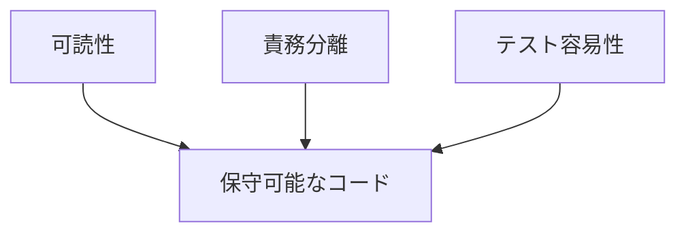
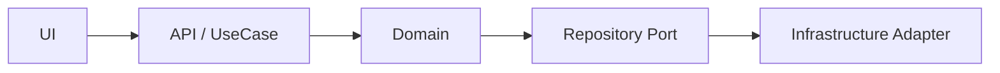

# レガシーコード考古学 コーディング規約

- 文書番号：LCA-CODE-001
- 版数：1.0
- 作成日：2026-07-18

---

## 1. 目的

本規約は、「レガシーコード考古学」の実装において、可読性、保守性、再利用性、テスト容易性を確保するためのコーディング上の共通ルールを定義する。

---

## 2. 基本原則

- 単一責務を守る
- 業務用語で命名する
- 副作用を局所化する
- 明示的な型と契約を重視する
- テストしやすい構造を優先する
- 失敗を隠さず、観測可能にする

---

## 3. 命名規約

### 3.1 クラス・型

- クラス名は名詞とする
- 抽象概念はドメイン名を優先する
- 役割接尾辞を明示する

例：
- `ProjectEntity`
- `BusinessRuleExtractor`
- `CamelRouteParser`
- `ImpactAnalysisUseCase`

### 3.2 メソッド・関数

- 動詞または動詞句で命名する
- 意味が曖昧な `process`, `handle`, `doThing` を避ける
- 真偽値は `is`, `has`, `can`, `should` を用いる

例：
- `extractBusinessRules`
- `loadProjectAssets`
- `isReviewRequired`

### 3.3 変数

- 略語を避ける
- 単位や意味を名前に含める
- 1文字変数はループインデックス等の限定用途のみ許可する

---

## 4. 構造規約

### 4.1 関数長

- 1関数1責務とする
- 長大な分岐は小関数へ分割する
- 例外処理、変換、永続化、通知を1関数に混在させない

### 4.2 クラス設計

- クラスは明確な責務境界を持つこと
- `Utils` への責務集中を禁止する
- 状態を持つクラスはライフサイクルを明示すること

### 4.3 依存関係

- ドメイン層はインフラ層へ直接依存しない
- フレームワーク依存は境界層に閉じ込める
- Parser, Extractor, Mapper, Repository の責務を混在させない

---

## 5. エラー処理規約

- 例外を握りつぶさない
- 文脈情報を付与して再送出する
- 業務エラーとシステムエラーを分離する
- リトライ可否を明示する
- ログには機密情報を含めない

---

## 6. ログ規約

- 構造化ログを優先する
- `traceId`, `projectId`, `jobId` を可能な限り含める
- デバッグ目的の一時ログを残さない
- ソース全文や秘密情報を出力しない

---

## 7. データ・時刻規約

- 日時はタイムゾーン付きで扱う
- null前提設計を避ける
- Optional相当を適切に使う
- 文字列連結で構造データを表現しない

---

## 8. テスト容易性規約

## 7.1 補足: シェル実行規約

- Shell から外部コマンドを実行する手順書・スクリプト・運用説明では、必要に応じて `source ~/.bash_profile` を前置して実行環境を初期化する
- 開発者依存の PATH 差異で失敗しやすいコマンドは、単独コマンドではなく初期化込みで記述する

- 外部依存は注入可能にする
- ファイルI/O、DB、LLM呼び出しは抽象化する
- テストデータを固定化できる設計を優先する
- 純粋関数化できる処理は純粋関数とする

---

## 9. 禁止事項

- 巨大クラス
- 巨大メソッド
- 暗黙的なグローバル状態
- 画面都合の分岐をドメインに混在
- 根拠なしの推論結果確定
- 一時対処コードの放置

---

## 10. 完了基準

- 命名が規約に従っている
- 関数責務が明確である
- テスト容易性が確保されている
- ログとエラー処理が実装されている
- レビューで規約違反が解消されている
