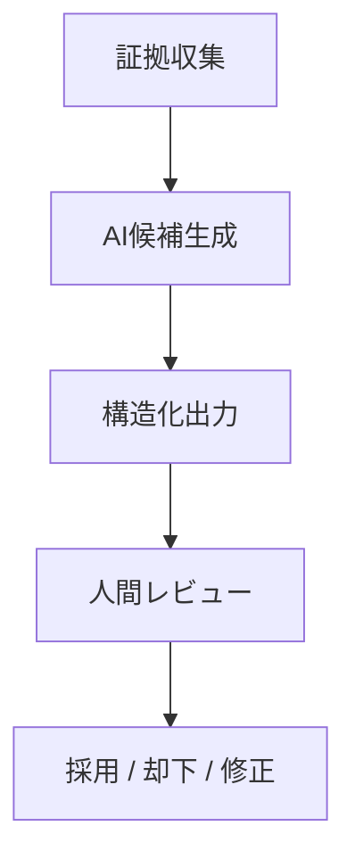
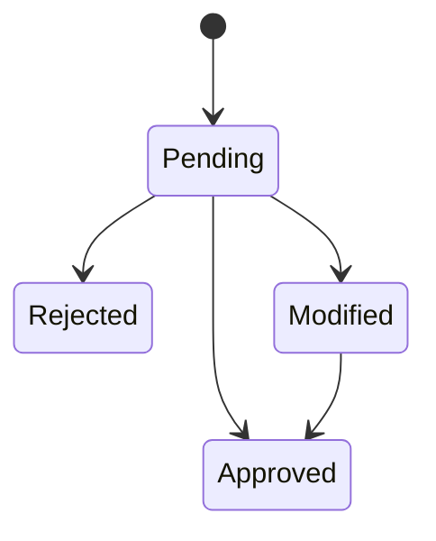

# レガシーコード考古学 AI利用規程

- 文書番号：LCA-AI-001
- 版数：1.0
- 作成日：2026-07-18

---

## 1. 目的

本規程は、「レガシーコード考古学」におけるAI/LLMの利用範囲、制御条件、監査要件、レビュー要件を定義し、安全かつ説明可能なAI活用を実現することを目的とする。

---

## 2. 基本原則

- AIは候補生成に用いる
- AIは最終決定者ではない
- AI出力は必ず根拠付きとする
- AI利用は監査可能でなければならない
- 機密情報送信は制御可能でなければならない

---

## 3. 利用許可範囲

AIは以下に利用してよい。

- 業務機能候補抽出
- 業務ルール候補抽出
- 例外条件候補抽出
- 設計書と実装の不一致候補抽出
- 影響分析説明生成
- モダナイゼーション案候補生成

---

## 4. 利用禁止範囲

AIを以下に単独利用してはならない。

- 構文解析の最終結果
- セキュリティ判定の最終決定
- 本番反映可否判断
- 根拠なし分類
- 人間レビュー不要の知識確定
- 監査証跡の改ざんまたは置換

---

## 5. 出力要件

AI出力は必ず構造化し、最低限以下を持つこと。

- `candidateType`
- `text`
- `confidenceLevel`
- `confidenceScore`
- `evidenceIds`
- `reason`
- `reviewStatus`
- `modelName`
- `promptVersion`

---

## 6. プロンプト管理

- プロンプトはGitで管理する
- 版番号を付与する
- 変更時はレビュー必須とする
- 実行時に使用版を保存する
- 本番利用プロンプトは履歴追跡可能とする

---

## 7. モデル管理

- モデル名、版、パラメータを記録する
- 温度設定は用途別に標準値を持つ
- モデル切替時は比較評価を行う
- 再現性が必要な処理は低温度または決定的制御を採用する

---

## 8. セキュリティ管理

- 外部送信可否を設定できること
- 顧客要件に応じてオンプレ/閉域LLMへ切替可能とすること
- 機密データのマスキング方針を持つこと
- LLM送信データと応答結果の監査ログを保持すること

---

## 9. 品質評価

- 自由文一致ではなく構造化項目単位で評価する
- evidence欠落は不合格とする
- confidence未設定は不合格とする
- 誤判定事例を再学習・再評価へ反映する

---

## 10. レビュー要件

- AI提案は `Pending` から開始する
- `Approved` は人間レビューでのみ付与可能とする
- `Rejected` は履歴を保持する
- `Modified` は修正差分を記録する

---

## 11. 監査要件

- 誰が実行したか
- いつ実行したか
- どのモデルを使ったか
- どのプロンプト版を使ったか
- どの証拠を渡したか
- どの出力を返したか
- 誰がレビューしたか

---

## 12. 違反時対応

- 根拠なしAI結果の採用は禁止
- 監査不能なAI出力は破棄対象とする
- セキュリティ違反の疑いがある場合は直ちに利用停止する
