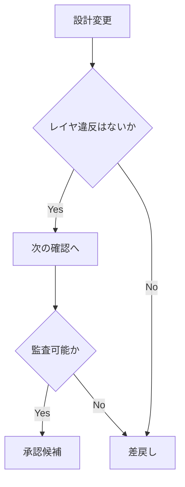

# レガシーコード考古学 レビュー観点チェックリスト

- 文書番号：LCA-REV-001
- 版数：1.0
- 作成日：2026-07-18

---

## 1. 目的

本チェックリストは、実装・設計・AI利用・データモデル変更時のレビュー観点を標準化することを目的とする。

---

## 2. 共通チェック

- [ ] 要件との対応が明確か
- [ ] 変更理由が説明されているか
- [ ] 影響範囲が整理されているか
- [ ] テスト方針が示されているか
- [ ] ドキュメント更新が含まれているか

---

## 3. アーキテクチャ観点

- [ ] レイヤ分離が守られているか
- [ ] 循環依存が発生していないか
- [ ] 非同期化すべき処理が同期実装されていないか
- [ ] ストレージ責務が混在していないか
- [ ] 差分再解析前提を壊していないか

---

## 4. データ観点

- [ ] ID規約に従っているか
- [ ] 必須メタデータを保持しているか
- [ ] 監査項目を失っていないか
- [ ] 根拠リンクが保持されるか
- [ ] 後方互換性が考慮されているか

---

## 5. AI観点

- [ ] AI利用範囲が適切か
- [ ] 構造化出力になっているか
- [ ] evidenceIds が必須化されているか
- [ ] confidence が保持されているか
- [ ] 人間レビュー前提になっているか
- [ ] プロンプト版が管理されているか

---

## 6. セキュリティ観点

- [ ] 機密情報が漏えいしないか
- [ ] ログに秘密情報が出ないか
- [ ] アクセス制御が適切か
- [ ] 外部送信制御が考慮されているか
- [ ] 監査ログが残るか

---

## 7. コード観点

- [ ] 命名が明確か
- [ ] 単一責務が守られているか
- [ ] 巨大クラス/巨大関数になっていないか
- [ ] 例外処理が適切か
- [ ] テストしやすい設計か

---

## 8. マージ判定

- [ ] 必須テストが通過している
- [ ] レビュー指摘が解消されている
- [ ] ドキュメント更新済み
- [ ] 監査要件を満たす
- [ ] 必要に応じてADRが追加されている
