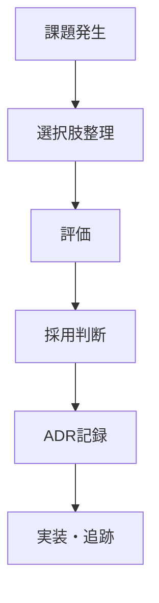

# ADRテンプレート

- 文書番号：LCA-ADR-TEMPLATE-001
- 版数：1.0
- 作成日：2026-07-18

---

## 1. タイトル

- ADR番号：`ADR-YYYY-NNN`
- タイトル：

---

## 2. ステータス

- Proposed / Accepted / Superseded / Rejected

---

## 3. 背景

この判断が必要になった背景、業務要件、制約条件を記載する。

---

## 4. 決定事項

採用する方式、技術、ルールを明記する。

---

## 5. 代替案

- 代替案A：
- 代替案B：
- 代替案C：

---

## 6. 採用理由

採用した理由を、品質・保守性・監査性・拡張性・セキュリティ観点から整理する。

---

## 7. 影響

- 実装への影響
- 運用への影響
- 既存機能への影響
- データ移行の要否
- テストへの影響

---

## 8. リスク

- 想定リスク
- 回避策
- 監視方法

---

## 9. 追跡情報

- 関連Issue：
- 関連PR：
- 関連文書：
- 決定日：
- 決定者：

---

## 10. 判断フロー

