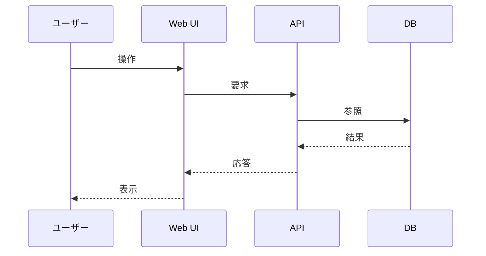
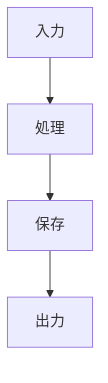
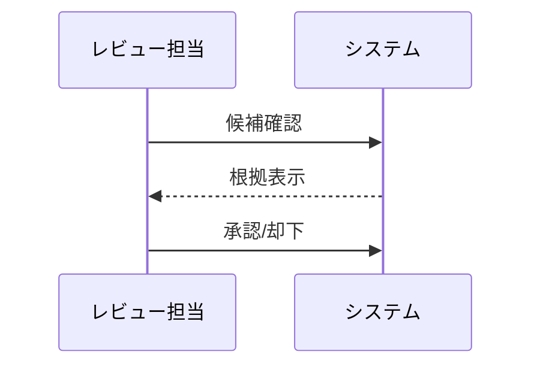
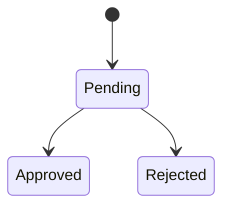

# レガシーコード考古学 Mermaid記述ルール

- 文書番号：LCA-MERMAID-001
- 版数：1.0
- 作成日：2026-07-18

---

## 1. 目的

本ルールは、設計書・企画書・仕様書に含まれる図、ダイアログ、構成図、フロー図を Mermaid で統一的に表現するための基準を定める。

---

## 2. 基本方針

- 図は原則 Mermaid で記述する
- 画像貼り付けよりもテキスト管理可能な図を優先する
- Git差分でレビュー可能な形式を採用する
- 図は文書本文だけでなくレビュー対象とする

---

## 3. 使用可能な図種別

- `flowchart`
- `sequenceDiagram`
- `stateDiagram-v2`
- `classDiagram`
- `erDiagram`
- `mindmap`
- `journey`

---

## 4. 記述ルール

### 4.1 命名

- ノード名は日本語可とする
- 必要に応じて英語識別子を括弧書きする
- 曖昧な `処理1`, `処理2` を避ける

### 4.2 構造

- 1図1目的とする
- 過密な図は分割する
- レイヤ図は左から右、または上から下に統一する
- 状態遷移は開始状態を明示する

### 4.3 ダイアログ

- 対話やレビュー手順は `sequenceDiagram` を使う
- 参加者名は役割ベースで記述する
- UI、API、DB、AI などを明確に分ける

---

## 5. 禁止事項

- ASCIIアート図を新規採用すること
- 同一文書で図の流れ方向を乱立させること
- 意味のない装飾ノードを置くこと
- 本文と不一致の図を放置すること

---

## 6. レビュー観点

- 図と本文が一致しているか
- 役割・責務が誤解なく読めるか
- レイヤ境界が明確か
- 状態遷移やシーケンスが実装と整合しているか

---

## 7. 推奨パターン

### システム構成図

### レビュー手順

### 状態管理

