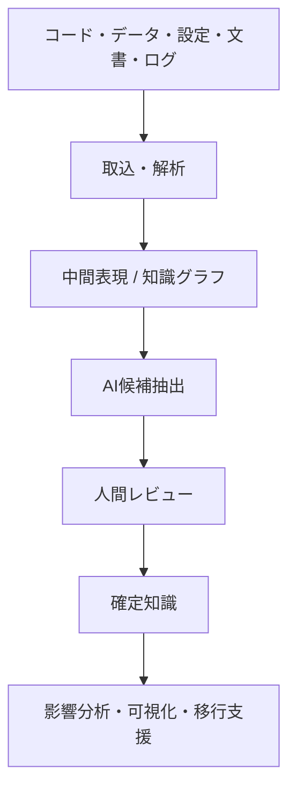
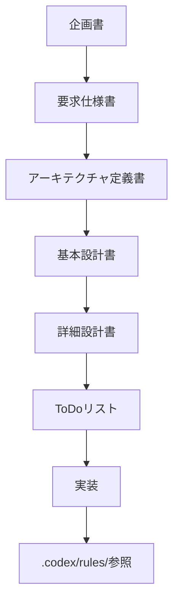

# legacy-code-archaeology

レガシーコード考古学は、**古いコードを新しい言語へ単純変換するツール**ではなく、コード・データ・設定・ジョブ・設計書・ログ・テスト・運用資料などから、**失われた業務知識を証拠付きで復元するプラットフォーム**の構想および設計資産をまとめたリポジトリです。

## 概要

企業のレガシーシステムでは、以下の問題が頻繁に発生します。

- 設計書が古い、または現行実装と一致しない
- 担当者が退職し、暗黙知が失われている
- コードの意味を誰も説明できない
- 同じ処理が複数箇所にある
- 例外処理に業務ルールが隠れている
- 外部システムとの依存関係が不明
- テスト仕様と実装が一致しない
- 変更影響を予測できない

本プロジェクトは、これらの課題に対して、**中間表現（IR）・知識グラフ・AI候補抽出・人間レビュー**を組み合わせたアプローチを採用します。



## このリポジトリに含まれるもの

### 企画・設計文書
- 企画書
- 要求仕様書
- アーキテクチャ定義書
- 基本設計書
- 詳細設計書
- ToDoリスト

### 正式ルール
- 実装ルール規定
- コーディング規約
- AI利用規程
- レビュー観点チェックリスト
- ADRテンプレート
- Mermaid記述ルール

## ディレクトリ構成

```text
.
├── README.md
├── LICENSE
├── .gitignore
├── documents/
│   ├── 01_企画書_レガシーコード考古学.md
│   ├── 02_要求仕様書_レガシーコード考古学.md
│   ├── 03_アーキテクチャ定義書_レガシーコード考古学.md
│   ├── 04_基本設計書_レガシーコード考古学.md
│   ├── 12_詳細設計書_レガシーコード考古学.md
│   ├── 13_ToDoリスト_レガシーコード考古学.md
│   └── README.md
└── .codex/
    └── rules/
        ├── README.md
        ├── 01_実装ルール規定.md
        ├── 02_コーディング規約.md
        ├── 03_AI利用規程.md
        ├── 04_レビュー観点チェックリスト.md
        ├── 05_ADRテンプレート.md
        └── 06_Mermaid記述ルール.md
```

## 推奨参照順序



## 主要コンセプト

### 1. Evidence First
すべての知識候補に根拠を持たせます。

### 2. Intermediate Representation Driven
言語依存の解析結果を共通の中間表現へ変換します。

### 3. Human in the Loop
AI出力は候補であり、人間レビューによってのみ確定します。

### 4. Technology-Neutral Knowledge
業務知識はJavaやSQLなどの構文そのものではなく、意味要素として保持します。

## 想定MVPスコープ

- Java / Spring解析
- Apache Camel Route解析
- SQL DDL解析
- application.properties / YAML解析
- Markdown / PDF設計書解析
- 知識グラフ生成
- 業務ルール候補生成
- 変更影響分析
- OpenShift移行課題抽出

## MVPデモ（最短）

```bash
source ~/.bash_profile
./scripts/local/start.sh
./gradlew bootRun
# 別ターミナル
curl -s http://localhost:8080/api/health
open http://localhost:8080/review/
```

詳細は `documents/19_デモシナリオ_MVP_レガシーコード考古学.md` を参照。

## ライセンス

このリポジトリは `MIT License` を採用しています。詳細は `LICENSE` を参照してください。

## ローカル開発環境の起動

**コンテナ実行には Podman を使用します（Docker は使用しません）。**

```bash
source ~/.bash_profile

# DB・Graph DBをローカル起動
podman compose -f podman-compose.yml up -d

# または
./scripts/local/start.sh

# アプリイメージビルド
./scripts/local/build.sh

# 停止
./scripts/local/stop.sh
```

詳細は `documents/16_OpenShiftデプロイ方針_レガシーコード考古学.md` を参照。

## 注意

本リポジトリは現時点では、主に**企画・設計・ルール定義・Phase 0〜3 の実装資産**を含みます。

## 公開・運用メモ

- 正式ルールは `.codex/rules/` を正本とします
- 企画・仕様・設計文書は `documents/` を参照してください
- 図・ダイアログ・フローは Mermaid で記述しています
