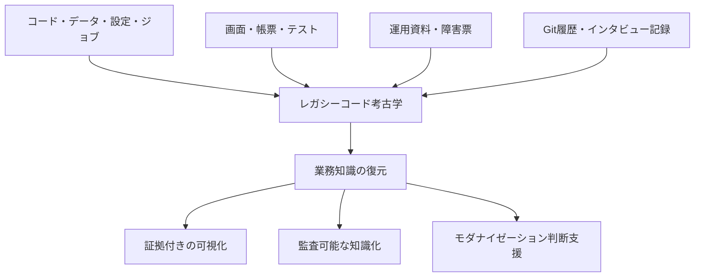
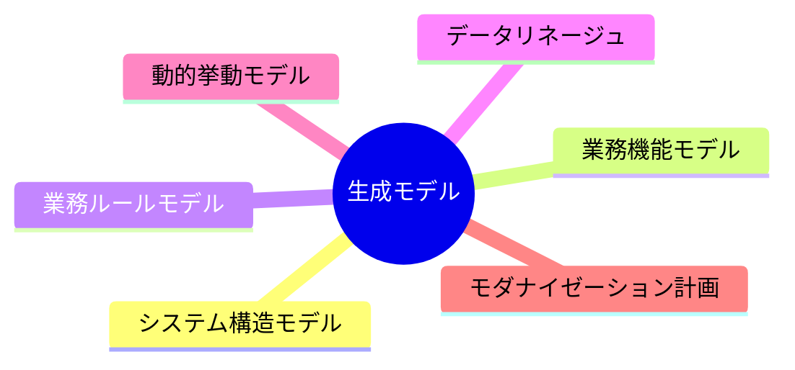
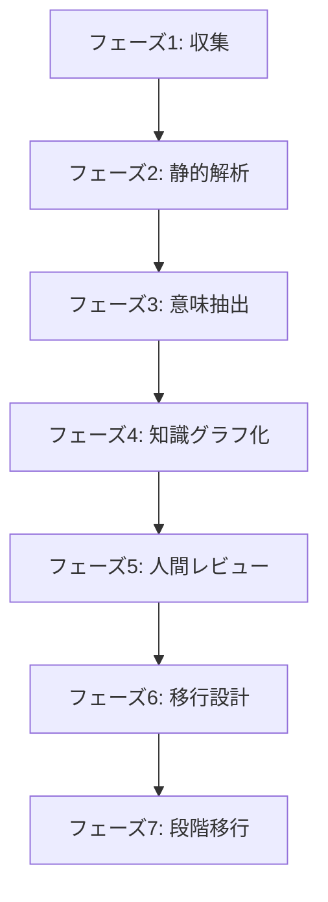

# レガシーコード考古学 企画書

- 文書番号：LCA-PROPOSAL-001
- 版数：1.0
- 作成日：2026-07-18
- 対象読者：経営層、事業部門責任者、情報システム部門、アーキテクト、モダナイゼーション推進担当

---

## 1. 企画概要

「レガシーコード考古学」は、古いコードを新しい言語へ単純変換するためのツールではない。  
本製品は、コード、データ、設定、ジョブ、画面、帳票、運用資料、障害票、Git履歴、インタビュー記録などに分散した情報から、失われた業務知識を復元するためのプラットフォームである。

本製品の価値は、ソースコードの要約や変換ではなく、**証拠付きで業務知識を可視化・構造化し、監査可能な形で蓄積すること**にある。

---

## 2. 背景

企業のレガシーシステムでは、以下の問題が頻繁に発生している。

- 設計書が古い、または現行実装と一致しない
- 担当者が退職し、暗黙知が失われている
- コードの意味を説明できる人がいない
- 同じ処理が複数箇所に重複している
- 例外処理に重要な業務ルールが埋もれている
- 外部システムとの依存関係が不明である
- テスト仕様と実装が一致しない
- 変更影響を事前に予測できない

生成AIはコード説明や変換を支援できるが、「コードを読めること」と「安全にモダナイズできること」は別問題である。  
実際の移行では、監査、コンプライアンス、業務依存関係、運用手順まで含めた判断が必要となる。

---

## 3. 基本コンセプト

### 3.1 製品の位置づけ

これは「古いコードを新しい言語へ変換するツール」ではない。  
本製品は、以下を対象に失われた業務知識を復元するプラットフォームである。

- コード
- データ
- 設定
- ジョブ
- 画面
- 帳票
- テスト
- 運用資料
- 障害票
- Git履歴
- インタビュー記録

### 3.2 「考古学」という名称の意味

コードだけを読んでも、システム全体や本来の業務意図は把握できない。  
業務知識は複数の断片に分散しているため、あたかも遺物を発掘し、関係を推定し、文明を復元するような作業が必要となる。

発掘対象の例：

- COBOL、PL/I、C、C++、古いJava
- JCL、シェル、バッチ
- SQL、ストアドプロシージャ
- DBスキーマ
- XML、設定ファイル
- 画面定義
- 帳票
- テストケース
- 運用手順書
- 障害票
- Git履歴
- インタビュー記録

---

## 4. 市場課題と解決方針

### 4.1 解決する問題

本製品は、次の課題を対象とする。

1. 設計書が古い
2. 担当者が退職している
3. コードの意味を誰も説明できない
4. 同じ処理が複数箇所にある
5. 例外処理に業務ルールが隠れている
6. 外部システムとの依存関係が不明
7. テスト仕様と実装が一致しない
8. 変更影響を予測できない

### 4.2 解決アプローチ

近年の研究では、レガシーコードを直接変換するのではなく、技術に依存しない中間モデルを作成し、そのモデルから新システムを生成するアプローチが提案されている。  
また、LLMによる単純なコード変換では暗黙の業務ルールや例外条件を失う可能性があり、業務ルールを検査可能なグラフとして明示してから変換する考え方が重要になっている。

本製品は、この考え方を実務向けに実装し、**中間表現＋知識グラフ＋人間レビュー**を軸に業務知識復元を実現する。

---

## 5. 提供価値

### 5.1 最大の差別化

一般的なコードAIとの差別化は、**コード生成ではなく、証拠付きの業務知識復元**である。

AIが「この処理は与信判定です」と推測した場合、必ず以下のような根拠を提示する。

- 該当コード
- 関連テーブル
- 呼び出し元
- テストケース
- ログ
- 設計書

### 5.2 信頼度モデル

すべての知識に信頼度を持たせる。

| 状態 | 意味 |
|---|---|
| Confirmed | コード、テスト、設計書が一致 |
| Likely | 複数の根拠がある |
| Inferred | AIによる推定 |
| Conflicted | 根拠が矛盾 |
| Unknown | 判断不能 |

この説明可能性と信頼度管理が、企業向け製品として重要な差別化要素となる。

---

## 6. プラットフォームの出力

本製品は、最終的に以下の6種類のモデルを生成する。

### 6.1 システム構造モデル

以下の依存関係を可視化する。

- モジュール
- 関数
- クラス
- ジョブ
- データベース
- 外部API
- メッセージ
- ファイル

### 6.2 業務機能モデル

コードを業務機能単位に再構成する。

例：

- 顧客登録
  - 本人確認
  - 重複確認
  - 顧客番号採番
  - 口座情報登録
  - 登録結果通知

### 6.3 業務ルールモデル

例：

- IF 顧客区分 = 法人
- AND 本人確認状態 = 完了
- AND 反社会的勢力チェック = 問題なし
- THEN 口座開設可能
- ELSE 審査保留

各ルールには以下を付与する。

- 根拠コード
- 関連DB項目
- 関連テスト
- 信頼度
- 人間による確認状態

### 6.4 データリネージュ

データがどこから来て、どこへ流れるかを示す。

例：

- 顧客入力
- API
- 顧客テーブル
- 夜間バッチ
- 集計テーブル
- 帳票
- 外部機関

### 6.5 動的挙動モデル

実行ログやトレースから以下を分析する。

- 実際に呼ばれた処理
- 通常経路
- エラー経路
- 未使用コード
- 性能ボトルネック

### 6.6 モダナイゼーション計画

機能ごとに次の候補を出力する。

- 維持
- 廃止
- 再ホスト
- 再プラットフォーム
- リファクタリング
- 再設計
- SaaS置換

---

## 7. 主要ワークフロー

### フェーズ1：収集

以下を取り込む。

- ソースコード
- DB定義
- 設計書
- チケット
- ログ
- テスト

### フェーズ2：静的解析

以下を解析する。

- AST
- 依存関係
- データアクセス
- 外部呼び出し

### フェーズ3：意味抽出

LLMが以下を候補化する。

- コードの役割
- 業務ルール
- 例外条件

### フェーズ4：知識グラフ化

以下のような関係をグラフへ登録する。

- 業務機能 → 実装する → プログラム
- 業務機能 → 読み込む → テーブル
- 業務機能 → 呼び出す → 外部API
- 業務機能 → 満たす → 業務ルール
- 業務機能 → 検証される → テストケース

### フェーズ5：人間によるレビュー

以下の関係者が確認する。

- 業務担当
- 元開発者
- 運用担当

### フェーズ6：移行設計

以下を生成する。

- API候補
- マイクロサービス境界
- Kafkaイベント
- Camel連携ルート
- データ移行
- OpenShift配置
- テスト戦略

### フェーズ7：段階移行

Strangler Patternなどを用いて、旧システムと新システムの共存を支援する。

---

## 8. 対象領域

### 8.1 初期対象領域

最初の対象は以下に絞る。

- 古いJava／Spring
- Apache Camel／Fuse
- C／C++
- シェル
- SQL
- Kafka／JMS
- REST／SOAP
- ファイル連携

### 8.2 絞り込みの理由

COBOL全般から開始すると、コンパイラ、JCL、CICS、IMS、DB2など対象範囲が大きくなりすぎる。  
そのため初期段階では、**Java／C++／Camelを使った通信・連携基盤の可視化とOpenShift移行支援**を主対象とする。

---

## 9. MVP

### 9.1 MVPの入力

- Gitリポジトリ
- JavaまたはCamelプロジェクト
- SQL DDL
- application.properties / YAML
- Markdown / Word / PDF設計書

### 9.2 MVPの出力

- システム構成図
- Camel Route一覧
- Endpoint一覧
- 外部接続一覧
- DBアクセス一覧
- 例外処理一覧
- 業務ルール候補
- 変更影響分析
- 設計書と実装の不一致
- OpenShift移行時の課題

### 9.3 MVPの価値例

以下に答えられるだけでも高い価値がある。

> このDBカラムを変更した場合、どのルート、API、バッチ、テストに影響するか

---

## 10. 収益モデル

### 10.1 アセスメントサービス

1システム当たりの調査サービスとして販売可能。

- 小規模：100万〜300万円
- 中規模：500万〜1,500万円
- 大規模：数千万円以上

### 10.2 SaaS

- 1リポジトリ：月額10万〜30万円
- 企業：月額50万〜数百万円
- オンプレミス／OpenShift版：個別見積もり

### 10.3 コンサルティング展開

解析結果を活用し、以下へ展開できる。

- OpenShift移行
- Camel再設計
- Kafkaイベント化
- API化
- テスト自動化
- モダナイゼーション計画

### 10.4 初期事業戦略

製品単体よりも、**解析サービス＋コンサルティング＋プラットフォーム**として始めるのが現実的である。

---

## 11. 期待効果

- レガシー資産の構造理解を短期間で可能にする
- 失われた業務知識の復元を支援する
- 監査性・説明責任を備えた形で移行判断を支援する
- モダナイゼーション投資の優先順位づけを可能にする
- 属人化した運用・保守を可視化し、組織知へ変える

---

## 12. まとめ

「レガシーコード考古学」は、コード変換ツールではなく、企業システムに埋もれた業務知識を証拠付きで復元するための知識基盤である。  
その価値は、可視化、説明可能性、監査性、人間レビューを組み込んだ知識化にある。

初期段階ではJava／Camel／連携基盤領域に集中し、アセスメントサービスとコンサルティングを組み合わせて市場投入することで、現実的かつ高付加価値な立ち上がりが期待できる。
