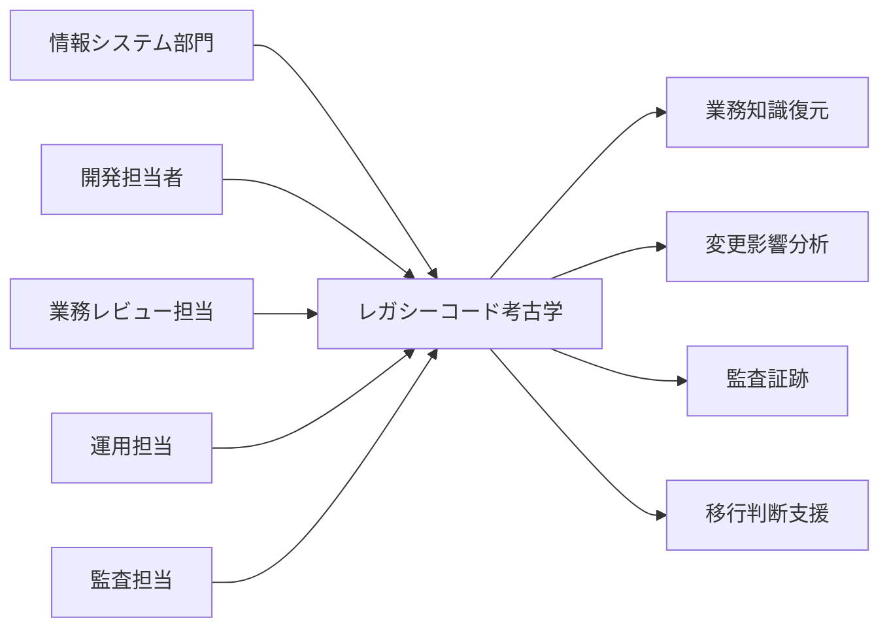
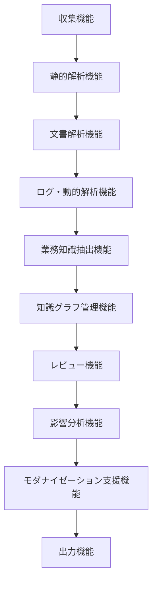

# レガシーコード考古学 要求仕様書

- 文書番号：LCA-REQ-001
- 版数：1.0
- 作成日：2026-07-18

---

## 1. 目的

本システムは、レガシーシステムに散在するコード・文書・ログ・運用情報から業務知識を復元し、説明可能な形で構造化して、保守・監査・移行・再設計を支援することを目的とする。

---

## 2. システム化対象

### 2.1 入力対象

- ソースコード
- SQL / DDL
- 設定ファイル
- ジョブ定義
- 設計書
- テスト仕様書
- ログ
- 障害票
- Git履歴
- ヒアリング記録

### 2.2 出力対象

- 可視化画面
- API
- エクスポート帳票
- グラフデータ
- 構造化中間モデル
- 移行設計候補

---

## 3. 業務要求

### 3.1 業務上の目的

- レガシー資産から失われた業務知識を復元する
- 保守担当者がコードの意味を説明できるようにする
- 設計書と実装の差異を特定する
- 変更影響を予測可能にする
- モダナイゼーション判断を支援する
- 監査・説明責任に対応できる証跡を残す

### 3.2 対象利用者

- 情報システム部門
- 開発担当者
- アーキテクト
- 業務部門レビュー担当
- 運用担当
- 監査担当
- モダナイゼーション推進担当

---

## 4. 機能要件

### 4.1 収集機能

1. Gitリポジトリからソースを取り込めること
2. ZIPアップロードにより資産を取り込めること
3. DDL、設定ファイル、設計書、PDF、Markdown等を取り込めること
4. ログ、テスト結果、障害票を取り込めること
5. 取り込み対象ごとにバージョンと取り込み日時を記録できること

### 4.2 静的解析機能

1. Java/C++/SQL/Shell/Camel設定を解析できること
2. ASTまたは同等の構文構造を抽出できること
3. 呼び出し関係を抽出できること
4. DBアクセス箇所を抽出できること
5. 外部API、メッセージング、ファイルI/Oを抽出できること
6. 例外処理分岐を抽出できること

### 4.3 文書解析機能

1. 設計書から機能名、項目名、画面名、帳票名を抽出できること
2. 文書中の用語とコード上の識別子候補を対応付けできること
3. 設計書と実装の不一致候補を抽出できること

### 4.4 ログ・動的解析機能

1. 実行ログから処理経路を復元できること
2. エラー経路を識別できること
3. 実行実績のない候補コードを未使用候補として識別できること
4. 応答時間や実行回数からボトルネック候補を示せること

### 4.5 業務知識抽出機能

1. 業務機能候補を生成できること
2. 業務ルール候補を抽出できること
3. 例外処理に含まれる業務条件を候補化できること
4. 各候補に根拠を紐付けできること
5. 各候補に信頼度状態を付与できること

### 4.6 知識グラフ管理機能

1. コード、DB、文書、テスト、ログを横断して関連付けできること
2. ノードとエッジの形で関係を管理できること
3. 根拠リンクを保持できること
4. 信頼度、レビュー状態、更新履歴を保持できること

### 4.7 レビュー機能

1. 人間が候補に対して確認、却下、修正できること
2. 確認理由を記録できること
3. レビュー結果を再学習・再解析へ反映できること
4. 業務担当、開発担当、運用担当で権限を分けられること

### 4.8 影響分析機能

1. DBカラム変更時の影響範囲を表示できること
2. API仕様変更時の影響範囲を表示できること
3. バッチ変更時の依存関係を表示できること
4. テスト不足箇所を示せること

### 4.9 モダナイゼーション支援機能

1. 機能ごとに維持・廃止・再設計等の候補を提示できること
2. OpenShift移行観点の課題を抽出できること
3. API化、イベント化、サービス分割候補を示せること
4. 段階移行方針を提示できること

### 4.10 出力機能

1. システム構成図を出力できること
2. 業務機能一覧を出力できること
3. 業務ルール一覧を出力できること
4. データリネージュ図を出力できること
5. 変更影響分析レポートを出力できること
6. CSV、JSON、PDF等でエクスポートできること

---

## 5. 非機能要件

### 5.1 性能要件

- 中規模Java/Camelリポジトリを数時間以内に初回解析できること
- 差分再解析は初回解析より大幅に短時間で完了すること
- 画面の主要検索は数秒以内で応答すること

### 5.2 拡張性要件

- 対応言語をプラグイン的に追加可能であること
- 新しい文書形式やログ形式を追加可能であること
- 新しい推論エージェントを追加可能であること

### 5.3 可用性要件

- SaaS版は業務時間帯の安定利用が可能であること
- オンプレミス版は顧客環境で独立運用可能であること

### 5.4 セキュリティ要件

- ソースコードや設計書を機密情報として扱うこと
- アクセス制御と監査ログを保持すること
- LLM利用時の外部送信可否を制御できること
- オンプレミス／閉域構成に対応できること
- Keycloak等による認証連携が可能であること

### 5.5 監査性要件

- すべての推論結果に根拠を保持すること
- 人間レビュー履歴を保持すること
- 出力物の生成時点と使用データ版を追跡可能とすること

### 5.6 運用性要件

- 解析ジョブ状態を監視できること
- 失敗時の再実行が可能であること
- エラーログを追跡可能であること

---

## 6. データ要求

### 6.1 管理対象データ

- プロジェクト情報
- 取り込み資産情報
- 解析ジョブ情報
- 抽出エンティティ情報
- 抽出リレーション情報
- 業務ルール候補
- 根拠リンク
- レビュー履歴
- モダナイゼーション提案
- 監査ログ

### 6.2 知識として保持すべき属性

- 対象名
- 種別
- 元ソース
- 関連証拠
- 信頼度
- レビュー状態
- 生成日時
- 更新日時
- バージョン

---

## 7. 制約条件

- 初期MVPではCOBOL全般を対象外とする
- 初期MVPではJava/Camel中心とする
- LLMの推論結果は必ず人間確認可能な形で出力する
- 変換生成よりも可視化・証拠化を優先する

---

## 8. 前提条件

- 対象資産が電子データとして取得可能であること
- 顧客が解析対象資産の利用許諾を有していること
- 顧客が最低限のレビュー体制を確保できること
- セキュリティ方針に応じてSaaSまたはオンプレミスを選択できること

---

## 9. 成功指標

- 主要依存関係の自動抽出精度
- 業務ルール候補のレビュー受容率
- 設計書と実装の不一致発見件数
- 変更影響分析の実用評価
- モダナイゼーション提案の採用率
- 解析サービス案件化率

---

## 10. スコープ

### 10.1 初期スコープ

- Java / Spring解析
- Apache Camel / Fuse解析
- SQL DDL解析
- 設定ファイル解析
- 文書解析
- 知識グラフ化
- 業務ルール候補抽出
- 変更影響分析
- OpenShift移行課題抽出

### 10.2 初期スコープ外

- COBOL全般の完全対応
- JCL / CICS / IMSの包括解析
- 自動コード生成
- 完全自律移行
- 本番APMとの高度統合
