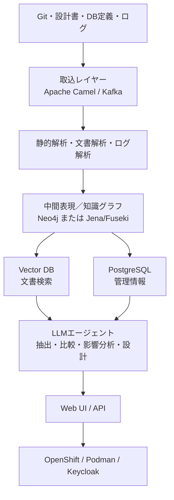
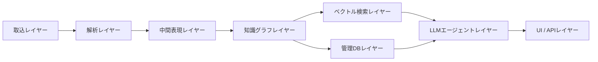
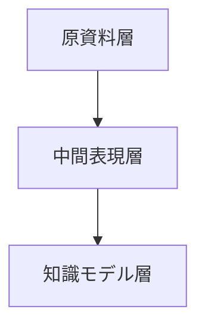

# レガシーコード考古学 アーキテクチャ定義書

- 文書番号：LCA-ARCH-001
- 版数：1.0
- 作成日：2026-07-18

---

## 1. 目的

本書は、「レガシーコード考古学」を実現するシステムアーキテクチャの全体構成、責務分担、主要技術要素、および設計方針を定義する。

---

## 2. アーキテクチャ方針

### 2.1 基本方針

1. 変換ツールではなく知識復元プラットフォームとする
2. 解析結果は中間表現と知識グラフに保持する
3. AI推論は必ず根拠付きで保持する
4. 静的解析、文書解析、動的解析を統合する
5. 人間レビューを正式なワークフローに組み込む
6. SaaSとオンプレミスの両提供形態に対応する

### 2.2 設計原則

- Evidence First：すべての知識に証拠を伴わせる
- Model Driven：中間モデルを中心に据える
- Human in the Loop：人間確認を必須化する
- Incremental Analysis：差分再解析を前提とする
- Technology Neutral Knowledge：技術非依存モデルを作る

---

## 3. 全体構成

---

## 4. 論理アーキテクチャ

### 4.1 取込レイヤー

#### 責務

- ソース、文書、DDL、ログ等の取り込み
- メタデータ付与
- 解析ジョブ起票
- 差分検知

#### 候補技術

- Apache Camel
- Kafka（大規模時）
- ファイルアップロードAPI
- Gitクローラ

### 4.2 解析レイヤー

#### 責務

- 静的解析
- 文書解析
- ログ解析
- シンボル抽出
- 呼出関係抽出
- データアクセス解析

#### 候補技術

- Java Parser / Eclipse JDT
- Clang系解析
- SQL Parser
- Camel Route解析
- OCR / PDF抽出ライブラリ
- ログパーサ

### 4.3 中間表現レイヤー

#### 責務

- 言語依存解析結果を共通モデルへ写像
- ノード／エッジの標準化
- 証拠参照保持
- 版管理

#### 設計方針

- ソースごとの差異を吸収し、上位推論で扱いやすい形式へ正規化する
- 技術要素と業務要素を分離しつつ関連付け可能にする

### 4.4 知識グラフレイヤー

#### 責務

- 実装・データ・文書・テスト・運用知識を統合管理
- 関係探索
- 影響分析
- 根拠参照

#### 候補技術

- Neo4j
- Jena / Fuseki

#### 採用観点

- グラフ探索の容易さ
- 推論拡張のしやすさ
- RDF運用適性
- エコシステムの成熟度

### 4.5 ベクトル検索レイヤー

#### 責務

- 設計書、障害票、議事録などの意味検索
- コード断片と文書断片の近傍検索
- LLMへの関連コンテキスト供給

### 4.6 管理DBレイヤー

#### 責務

- ユーザー
- プロジェクト
- 解析ジョブ
- レビュー状態
- 権限
- 監査ログ
- 出力物管理

#### 候補技術

- PostgreSQL

### 4.7 LLMエージェントレイヤー

#### 責務

- 業務機能候補抽出
- 業務ルール候補抽出
- 不一致比較
- 変更影響説明
- 移行案生成

#### 制御方針

- RAGで関連証拠を限定投入する
- 出力は構造化JSONに制約する
- 信頼度、根拠ID、判定理由を必須項目とする

### 4.8 UI / APIレイヤー

#### 責務

- 可視化
- 検索
- レビュー
- 差分比較
- レポート生成
- 外部連携API提供

---

## 5. データアーキテクチャ

### 5.1 データの3層構造

#### 原資料層

- ソースコード
- 設計書
- ログ
- チケット
- テスト

#### 中間表現層

- AST要約
- 呼出関係
- DB参照
- エンドポイント定義
- 例外分岐
- 文書用語抽出

#### 知識モデル層

- 業務機能
- 業務ルール
- データリネージュ
- モダナイゼーション候補
- 信頼度
- レビュー結果

### 5.2 代表ノード種別

- Program
- Function
- Class
- Route
- Endpoint
- Table
- Column
- File
- Batch
- API
- MessageTopic
- Document
- TestCase
- BusinessCapability
- BusinessRule
- ExceptionFlow
- Evidence

### 5.3 代表エッジ種別

- CALLS
- READS
- WRITES
- EMITS
- CONSUMES
- IMPLEMENTS
- DESCRIBES
- TESTS
- DERIVED_FROM
- SUPPORTS
- CONFLICTS_WITH
- AFFECTS
- VERIFIED_BY

---

## 6. 配備アーキテクチャ

### 6.1 開発・検証環境

- Podman / Docker互換環境
- 単一OpenShift namespaceまたはローカルKubernetes
- 小規模データでの解析検証

### 6.2 本番環境

- OpenShift上へのコンテナ配備
- Keycloak連携
- PostgreSQL
- Graph DB
- Vector DB
- オブジェクトストレージ
- LLM接続先（社内／外部）

### 6.3 配備設計上の考慮

- 解析ジョブは非同期ワーカー化する
- UI/APIと解析処理を分離する
- 再解析要求に対応できるキュー制御を行う
- 顧客要件に応じて閉域構成へ対応する

---

## 7. セキュリティアーキテクチャ

- SSO連携：Keycloak
- RBAC：閲覧、レビュー、管理、監査
- 機密情報保護：保管時暗号化、通信暗号化
- 監査ログ：推論、レビュー、出力、参照
- LLM利用制御：外部送信ON/OFF、匿名化、マスキング
- テナント分離：企業単位の論理分離、必要に応じ物理分離

---

## 8. 主要技術候補

| レイヤー | 候補技術 |
|---|---|
| 取込 | Apache Camel, Kafka |
| 静的解析 | Java Parser, Eclipse JDT, Clang, SQL Parser |
| 文書解析 | PDF抽出, OCR, Markdown/Office parser |
| 知識グラフ | Neo4j, Jena/Fuseki |
| 管理DB | PostgreSQL |
| 検索 | Vector DB |
| UI/API | Webアプリケーション, REST API |
| 認証 | Keycloak |
| 実行基盤 | OpenShift, Podman |

---

## 9. MVPアーキテクチャ

MVPでは過剰構成を避け、以下を優先する。

- Kafkaは任意
- Java/Camel解析に集中
- Graph DB＋PostgreSQLを中核にする
- 文書解析はMarkdown/PDF優先
- LLMは業務ルール候補抽出と差分比較に限定

---

## 10. アーキテクチャ上の重要判断

### 10.1 中間表現を持つ理由

直接コードから新システムを生成するのではなく、中間表現を経由することで、以下の利点を得る。

- 技術依存性の低減
- 証拠と知識の分離管理
- 再解析・差分比較の容易化
- 複数言語への横断対応

### 10.2 知識グラフを採用する理由

グラフ構造により、以下を実現しやすい。

- 多段依存の追跡
- 業務ルールと実装の接続
- 文書・テスト・コード横断の探索
- 変更影響分析
- 根拠の説明可能性

### 10.3 Human in the Loopを採用する理由

業務ルールや例外条件は、完全自動抽出だけでは誤判定のリスクがある。  
そのため、人間レビューを正式な設計要素として組み込み、AI推論を承認可能な知識へ昇格させる。

---

## 11. 今後の拡張方針

- COBOL / JCL対応
- CICS / IMS / DB2対応
- 高度な動的解析統合
- 設計意図の履歴推定
- インタビュー記録の知識化
- 移行設計自動生成強化
- サービス分割シミュレーション
