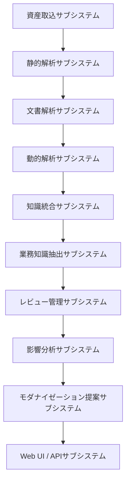
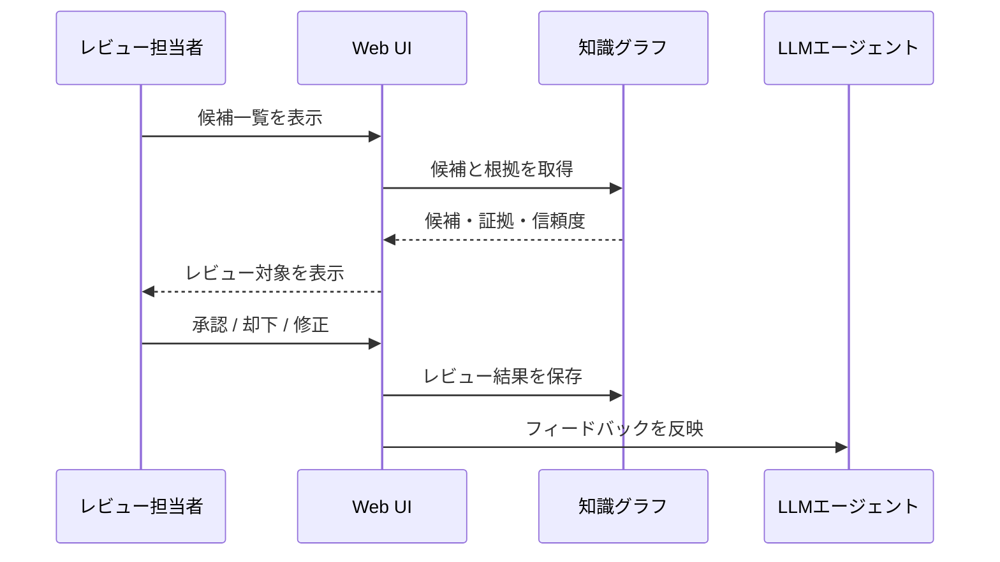
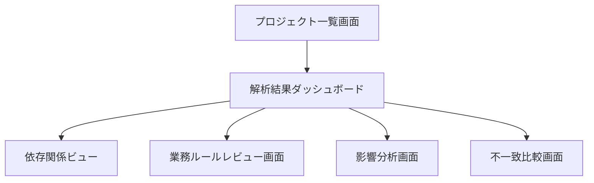

# レガシーコード考古学 基本設計書

- 文書番号：LCA-BD-001
- 版数：1.0
- 作成日：2026-07-18

---

## 1. 目的

本書は、企画書、要求仕様書、アーキテクチャ定義書に基づき、MVPおよび初期製品版の基本的な機能構成、データ設計、画面設計、処理設計、外部インタフェースを定義する。

---

## 2. システム概要

本システムは、レガシー資産を収集・解析し、構造情報と業務知識を知識グラフとして蓄積し、ユーザーへ可視化・レビュー・影響分析・移行支援機能を提供する。

---

## 3. サブシステム構成



1. 資産取込サブシステム
2. 静的解析サブシステム
3. 文書解析サブシステム
4. 動的解析サブシステム
5. 知識統合サブシステム
6. 業務知識抽出サブシステム
7. レビュー管理サブシステム
8. 影響分析サブシステム
9. モダナイゼーション提案サブシステム
10. Web UI / APIサブシステム

---

## 4. 機能設計

### 4.1 資産取込機能

#### 入力

- Git URL
- アップロードファイル
- ログファイル
- DDL
- 設計書

#### 処理

- ファイル保存
- メタデータ抽出
- ハッシュ計算
- バージョン登録
- 解析ジョブ起票

#### 出力

- 取り込み結果
- 解析ジョブID
- エラー一覧

### 4.2 静的解析機能

#### 対象

- Java
- Camel
- SQL
- Shell
- 一部C/C++

#### 処理

- 構文解析
- シンボル抽出
- 呼出グラフ生成
- DBアクセス抽出
- Endpoint抽出
- 例外処理抽出

#### 出力

- Program一覧
- Route一覧
- API一覧
- DBアクセス一覧
- 例外一覧

### 4.3 文書解析機能

#### 処理

- テキスト抽出
- 章構造抽出
- 用語抽出
- コード要素との照合
- 差分候補抽出

#### 出力

- 文書用語辞書
- 設計記述一覧
- 不一致候補一覧

### 4.4 動的解析機能

#### 処理

- ログ読み込み
- トレース識別
- 実行パス抽出
- エラー経路抽出
- 未使用候補抽出
- ボトルネック候補抽出

#### 出力

- 実行経路一覧
- エラー経路一覧
- 未使用コード候補
- 性能課題候補

### 4.5 業務知識抽出機能

#### 処理

- 関連コード群をコンテキスト化
- LLMへ候補抽出要求
- 構造化結果受領
- 根拠リンク付与
- 信頼度算定

#### 出力

- 業務機能候補
- 業務ルール候補
- 例外ルール候補

### 4.6 レビュー機能



#### 処理

- 候補一覧表示
- 根拠表示
- 承認／却下／修正
- コメント保存
- 履歴保存

#### 出力

- レビュー結果
- 確認済み知識
- 差戻し項目

### 4.7 影響分析機能

#### 入力

- 変更対象（DBカラム、API、クラス、Route等）

#### 処理

- グラフ探索
- 依存関係集約
- テスト関連付け
- 影響レベル算定

#### 出力

- 影響対象一覧
- 推奨確認項目
- 関連証拠

### 4.8 モダナイゼーション提案機能

#### 処理

- 技術負債観点
- 利用頻度観点
- 結合度観点
- 外部依存観点
- 運用制約観点
- OpenShift適合観点

#### 出力

- 維持／廃止／再設計候補
- API化候補
- イベント化候補
- 移行優先順位

---

## 5. 画面設計



### 5.1 プロジェクト一覧画面

#### 主な表示項目

- プロジェクト名
- 対象資産種別
- 最終解析日時
- 解析状態
- レビュー進捗

### 5.2 解析結果ダッシュボード

#### 主な表示内容

- システム構成サマリ
- Route数
- API数
- DBテーブル数
- 外部接続数
- 例外処理数
- 不一致候補数
- 要レビュー件数

### 5.3 依存関係ビュー

#### 表示内容

- 呼出関係グラフ
- Routeフロー
- DBアクセス関係
- 外部接続関係

### 5.4 業務ルールレビュー画面

#### 表示内容

- ルール本文
- 信頼度
- 根拠コード
- 関連テーブル
- 関連テスト
- レビュー状態
- コメント

### 5.5 影響分析画面

#### 入力

- 対象要素検索

#### 出力

- 影響範囲一覧
- 深さ別依存
- 関連テスト
- 関連文書
- 移行上の注意点

### 5.6 不一致比較画面

#### 表示内容

- 設計書記述
- 実装要素
- 差異理由候補
- 修正提案先

---

## 6. API基本設計

### 6.1 主要API一覧

- `POST /api/projects`
- `GET /api/projects`
- `POST /api/projects/{id}/ingest`
- `POST /api/projects/{id}/analyze`
- `GET /api/projects/{id}/graph`
- `GET /api/projects/{id}/rules`
- `POST /api/projects/{id}/rules/{ruleId}/review`
- `GET /api/projects/{id}/impact`
- `GET /api/projects/{id}/mismatch`
- `GET /api/projects/{id}/modernization-plan`

### 6.2 APIレスポンス設計方針

- JSON形式
- すべての推論結果に `confidence` と `evidenceIds` を持たせる
- レビュー可能データには `reviewStatus` を含める
- 非同期処理には `jobId` を返す

### 6.3 レスポンス例

```json
{
  "ruleId": "BR-0001",
  "text": "顧客区分が法人で本人確認完了かつ反社チェック問題なしの場合に口座開設可能",
  "confidence": {
    "level": "Likely",
    "score": 0.82
  },
  "evidenceIds": ["EV-120", "EV-233", "EV-451"],
  "reviewStatus": "Pending"
}
```

---

## 7. データ設計

### 7.1 管理DB主要テーブル

- projects
- assets
- ingestion_jobs
- analysis_jobs
- extracted_entities
- extracted_relations
- business_rules
- evidence_links
- reviews
- modernization_plans
- audit_logs

### 7.2 主要テーブル項目例

#### projects

- id
- name
- description
- created_at
- updated_at

#### assets

- id
- project_id
- asset_type
- file_path
- version_hash
- imported_at

#### business_rules

- id
- project_id
- rule_text
- confidence
- review_status
- source_type
- created_at

#### evidence_links

- id
- target_type
- target_id
- evidence_type
- evidence_ref
- weight

#### reviews

- id
- target_type
- target_id
- reviewer_id
- action
- comment
- reviewed_at

---

## 8. 知識グラフ基本設計

### 8.1 ノード例

- Program
- Class
- Method
- Route
- Endpoint
- Table
- Column
- BusinessFunction
- BusinessRule
- DocumentSection
- TestCase
- LogEvent

### 8.2 関係例

- `Method CALLS Method`
- `Route USES Endpoint`
- `Method READS Table`
- `BusinessRule DERIVED_FROM Method`
- `BusinessFunction VERIFIED_BY TestCase`
- `DocumentSection DESCRIBES BusinessFunction`

### 8.3 信頼度管理

各知識ノードは以下を持つ。

- confidence_level
- confidence_score
- evidence_count
- review_status
- last_reviewed_at

---

## 9. 処理方式設計

### 9.1 バッチ／非同期処理

以下は非同期ジョブとする。

- 大量資産取り込み
- 静的解析
- 文書解析
- LLM推論
- 再解析
- レポート生成

### 9.2 再解析方式

- ファイル差分を検知
- 変更部分のみ再解析
- 依存先へ影響波及解析
- 旧結果との差分表示

### 9.3 障害時処理

- ジョブ失敗時は失敗理由を保存
- 再実行を可能にする
- 部分成功時は成功範囲を保持する

---

## 10. 権限設計

### 10.1 ロール

- 管理者
- 解析担当
- 業務レビュー担当
- 運用レビュー担当
- 閲覧者
- 監査担当

### 10.2 権限制御例

| 機能 | 管理者 | 解析担当 | 業務レビュー | 運用レビュー | 閲覧者 | 監査 |
|---|---|---|---|---|---|---|
| 取込 | ○ | ○ | - | - | - | - |
| 解析実行 | ○ | ○ | - | - | - | - |
| 候補レビュー | ○ | ○ | ○ | ○ | - | - |
| 閲覧 | ○ | ○ | ○ | ○ | ○ | ○ |
| 監査ログ参照 | ○ | - | - | - | - | ○ |

---

## 11. MVPスコープ

### 11.1 対象内

- Java / Spring解析
- Camel Route解析
- SQL DDL解析
- 設定ファイル解析
- Markdown / PDF設計書解析
- 知識グラフ生成
- 業務ルール候補生成
- 影響分析
- OpenShift移行課題抽出

### 11.2 対象外

- COBOLフル解析
- JCL / CICS / IMS完全対応
- 自動コード生成
- 完全自律移行
- 本番実行トレースの深いAPM連携

---

## 12. 今後の詳細化対象

今後の詳細設計フェーズでは、以下を追加定義する。

- 画面遷移図
- API入出力項目定義
- ER図
- グラフスキーマ定義
- ジョブフロー定義
- 例外処理詳細
- 監査ログ設計
- OpenShift配備定義
