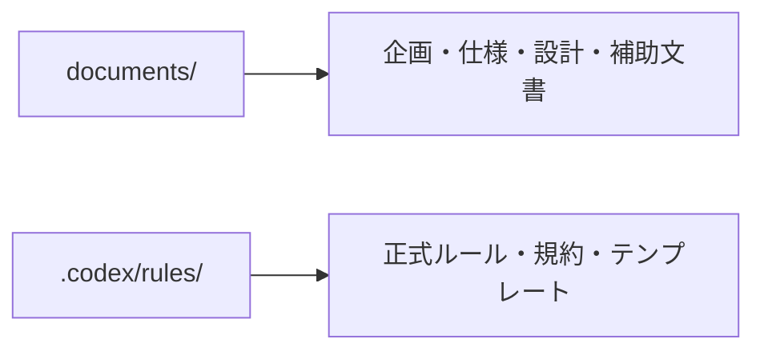

# ルール文書配置方針

- 文書番号：LCA-RULE-LOC-001
- 版数：1.0
- 作成日：2026-07-18

---

## 1. 目的

本書は、ルール文書の正式配置先を定義し、`documents/` と `.codex/rules/` の役割分担を明確化することを目的とする。

---

## 2. 配置方針

- 正式なルールファイルは `.codex/rules/` 配下に配置する
- `documents/` 配下には企画書、仕様書、設計書、補助説明文書を配置する
- 実装・運用時に参照すべき規約は `.codex/rules/` を正本とする

---

## 3. 正本一覧

- `.codex/rules/01_実装ルール規定.md`
- `.codex/rules/02_コーディング規約.md`
- `.codex/rules/03_AI利用規程.md`
- `.codex/rules/04_レビュー観点チェックリスト.md`
- `.codex/rules/05_ADRテンプレート.md`
- `.codex/rules/06_Mermaid記述ルール.md`
- `.codex/rules/README.md`

---

## 4. 運用ルール

- ルール変更時は `.codex/rules/` 側を先に更新する
- `documents/` 側に重複コピーを増やさない
- 関連する設計書・仕様書からは `.codex/rules/` を参照する
