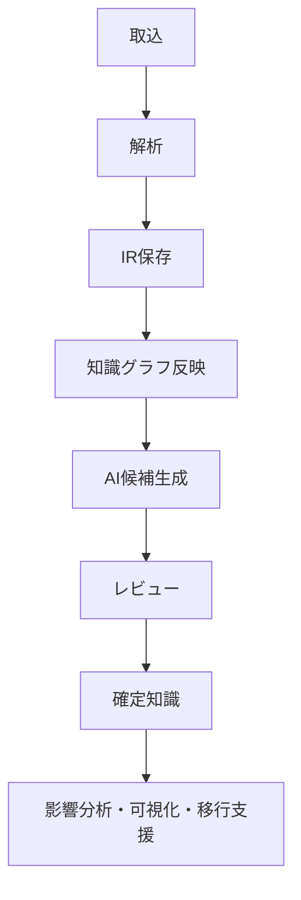
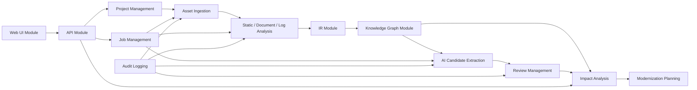
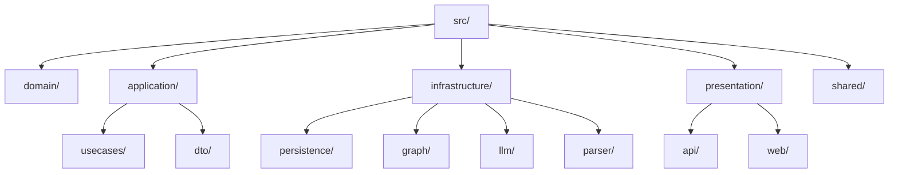
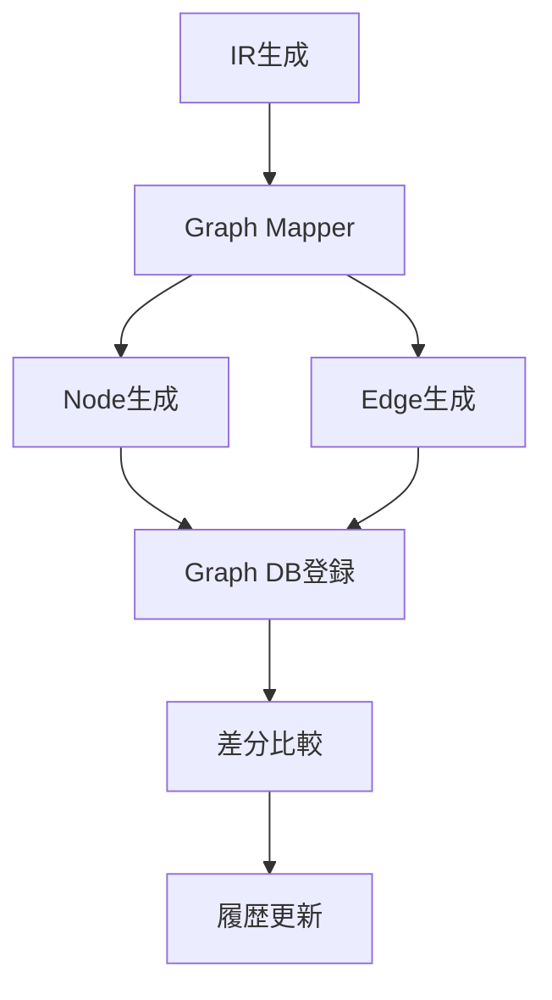
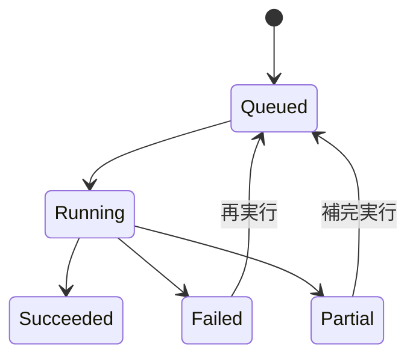
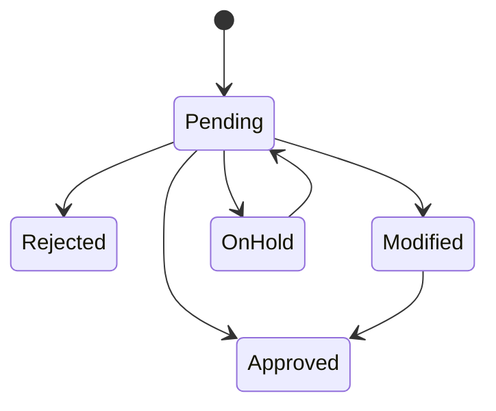
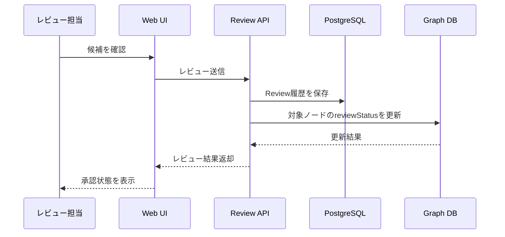

# レガシーコード考古学 詳細設計書

- 文書番号：LCA-DD-001
- 版数：1.0
- 作成日：2026-07-18

---

## 1. 目的

本書は、基本設計書を具体的な実装単位へ落とし込み、モジュール構成、データ構造、API入出力、ジョブ処理、レビュー状態遷移、監査、エラー処理、テスト観点を詳細化することを目的とする。

---

## 2. 設計方針

- 解析器は直接UI向けデータを生成せず、中間表現（IR）を生成する
- AI出力は候補として扱い、必ず evidenceIds と confidence を保持する
- 差分再解析を前提とし、資産・解析結果・知識の版を追跡可能にする
- 非同期ジョブ中心で処理し、APIは受付と参照を責務とする
- 監査可能性を満たすため、重要操作はすべて監査ログへ記録する



---

## 3. 実装対象モジュール

### 3.1 モジュール一覧

1. Project Management Module
2. Asset Ingestion Module
3. Static Analysis Module
4. Document Analysis Module
5. Log Analysis Module
6. Intermediate Representation Module
7. Knowledge Graph Module
8. AI Candidate Extraction Module
9. Review Management Module
10. Impact Analysis Module
11. Modernization Planning Module
12. Job Management Module
13. Audit Logging Module
14. Authentication / Authorization Module
15. API Module
16. Web UI Module

### 3.2 モジュール依存関係



---

## 4. ディレクトリ構成方針



### 4.1 推奨パッケージ

- `src/domain/projects/`
- `src/domain/assets/`
- `src/domain/analysis/`
- `src/domain/knowledge/`
- `src/domain/reviews/`
- `src/application/usecases/`
- `src/application/dto/`
- `src/infrastructure/persistence/`
- `src/infrastructure/graph/`
- `src/infrastructure/parser/`
- `src/infrastructure/llm/`
- `src/presentation/api/`
- `src/presentation/web/`
- `src/shared/logging/`
- `src/shared/audit/`

---

## 5. ドメインモデル詳細

### 5.1 主要エンティティ

#### ProjectEntity
- `projectId`
- `name`
- `description`
- `status`
- `createdAt`
- `updatedAt`

#### AssetEntity
- `assetId`
- `projectId`
- `assetType`
- `sourcePath`
- `versionHash`
- `importedAt`

#### AnalysisJobEntity
- `jobId`
- `projectId`
- `jobType`
- `status`
- `requestedBy`
- `startedAt`
- `completedAt`
- `errorCode`
- `errorMessage`

#### EvidenceEntity
- `evidenceId`
- `sourceAssetId`
- `sourcePath`
- `sourceRange`
- `evidenceType`
- `snippet`
- `createdAt`

#### BusinessRuleEntity
- `businessRuleId`
- `projectId`
- `text`
- `confidenceLevel`
- `confidenceScore`
- `reviewStatus`
- `modelName`
- `promptVersion`
- `createdAt`
- `updatedAt`

#### ReviewEntity
- `reviewId`
- `targetType`
- `targetId`
- `action`
- `comment`
- `reviewerId`
- `reviewedAt`

---

## 6. 中間表現（IR）詳細

### 6.1 IR設計方針

- 言語固有構造を吸収しつつ、構造解析結果を失わない
- 解析器ごとの差異を mapper で吸収する
- 業務知識候補は IR を入力として生成し、IR自体に業務解釈を混在させない

### 6.2 IR主要オブジェクト

#### ProgramIr
```json
{
  "id": "ENT-1001",
  "type": "Program",
  "name": "CustomerRegistrationService",
  "sourceAssetId": "AST-1001",
  "sourcePath": "src/main/java/com/example/CustomerRegistrationService.java",
  "language": "Java",
  "parserVersion": "java-parser-1.0.0"
}
```

#### RouteIr
```json
{
  "id": "ENT-2001",
  "type": "Route",
  "name": "customer-registration-route",
  "sourceAssetId": "AST-1002",
  "sourcePath": "src/main/resources/routes/customer.xml",
  "fromEndpoint": "jms:queue:customer.in",
  "toEndpoints": ["bean:customerService", "http://notification/api/send"]
}
```

#### RelationIr
```json
{
  "id": "REL-3001",
  "type": "CALLS",
  "fromId": "ENT-1001",
  "toId": "ENT-1002",
  "sourceAssetId": "AST-1001",
  "sourcePath": "src/main/java/com/example/CustomerRegistrationService.java",
  "sourceRange": {
    "startLine": 40,
    "endLine": 40
  }
}
```

---

## 7. 知識グラフ詳細設計

### 7.1 ノード種別

- Project
- Asset
- Program
- Class
- Method
- Route
- Endpoint
- Table
- Column
- Document
- DocumentSection
- TestCase
- LogEvent
- BusinessFunction
- BusinessRule
- Evidence
- Review

### 7.2 エッジ種別

- `CONTAINS`
- `CALLS`
- `READS`
- `WRITES`
- `USES`
- `IMPLEMENTS`
- `DESCRIBES`
- `VERIFIED_BY`
- `DERIVED_FROM`
- `AFFECTS`
- `RELATED_TO`
- `REVIEWED_BY`

### 7.3 グラフ反映フロー



---

## 8. API詳細設計

### 8.1 プロジェクトAPI

#### `POST /api/projects`

**Request**
```json
{
  "name": "legacy-integration-platform",
  "description": "Java/Camel連携基盤解析プロジェクト"
}
```

**Response**
```json
{
  "projectId": "PRJ-1001",
  "name": "legacy-integration-platform",
  "status": "Created"
}
```

### 8.2 資産取込API

#### `POST /api/projects/{projectId}/ingest`

**Request**
```json
{
  "ingestionType": "GitRepository",
  "repositoryUrl": "https://example.com/legacy.git",
  "branch": "main"
}
```

**Response**
```json
{
  "jobId": "JOB-2001",
  "status": "Queued"
}
```

### 8.3 解析API

#### `POST /api/projects/{projectId}/analyze`

**Request**
```json
{
  "analysisTypes": ["StaticAnalysis", "DocumentAnalysis", "AiExtraction"],
  "forceFullReanalysis": false
}
```

**Response**
```json
{
  "jobId": "JOB-3001",
  "status": "Queued"
}
```

### 8.4 業務ルール取得API

#### `GET /api/projects/{projectId}/rules`

**Response**
```json
{
  "items": [
    {
      "businessRuleId": "BR-1001",
      "text": "顧客区分が法人で本人確認完了の場合に口座開設可能",
      "confidence": {
        "level": "Likely",
        "score": 0.82
      },
      "evidenceIds": ["EV-120", "EV-233"],
      "reviewStatus": "Pending"
    }
  ]
}
```

### 8.5 レビューAPI

#### `POST /api/projects/{projectId}/rules/{businessRuleId}/review`

**Request**
```json
{
  "action": "Approved",
  "comment": "業務仕様と一致を確認"
}
```

**Response**
```json
{
  "reviewId": "REV-5001",
  "reviewStatus": "Approved"
}
```

---

## 9. ジョブ管理詳細設計

### 9.1 ジョブ種別

- `IngestionJob`
- `StaticAnalysisJob`
- `DocumentAnalysisJob`
- `LogAnalysisJob`
- `AiExtractionJob`
- `GraphSyncJob`
- `ReportExportJob`
- `ReanalysisJob`

### 9.2 状態遷移



### 9.3 ジョブ実行ルール

- 1プロジェクト内では同種ジョブの多重実行を制御する
- 差分解析対象がない場合は `Succeeded` で即時終了可能とする
- ジョブ失敗時は `errorCode`, `errorMessage`, `failedStep` を保持する

---

## 10. レビュー機能詳細設計

### 10.1 レビュー対象

- BusinessRule
- BusinessFunction
- MismatchCandidate
- ModernizationCandidate

### 10.2 レビュー状態遷移



### 10.3 シーケンス



---

## 11. 監査ログ詳細設計

### 11.1 監査対象イベント

- プロジェクト作成
- 資産取込
- 解析実行
- AI推論実行
- レビュー実施
- ルール承認/却下
- レポート出力
- 権限変更

### 11.2 監査ログ項目

- `auditLogId`
- `eventType`
- `projectId`
- `jobId`
- `userId`
- `targetType`
- `targetId`
- `timestamp`
- `details`

---

## 12. エラー処理詳細設計

### 12.1 エラー分類

- `BusinessError`
- `ValidationError`
- `ParserError`
- `ExternalServiceError`
- `AuthorizationError`
- `SystemError`

### 12.2 APIエラー応答例

```json
{
  "errorCode": "ANALYSIS_JOB_CONFLICT",
  "message": "同一プロジェクトで同種解析ジョブが実行中です。",
  "traceId": "TRC-123456"
}
```

---

## 13. DBテーブル詳細設計

### 13.1 projects

| カラム名 | 型 | 説明 |
|---|---|---|
| id | bigint | 内部キー |
| project_id | varchar | 外部表示ID |
| name | varchar | プロジェクト名 |
| description | text | 説明 |
| created_at | timestamptz | 作成日時 |
| updated_at | timestamptz | 更新日時 |

### 13.2 analysis_jobs

| カラム名 | 型 | 説明 |
|---|---|---|
| id | bigint | 内部キー |
| job_id | varchar | 外部表示ID |
| project_id | varchar | プロジェクトID |
| job_type | varchar | ジョブ種別 |
| status | varchar | 状態 |
| requested_by | varchar | 実行依頼者 |
| started_at | timestamptz | 開始日時 |
| completed_at | timestamptz | 完了日時 |
| error_code | varchar | エラーコード |
| error_message | text | エラー内容 |

### 13.3 business_rules

| カラム名 | 型 | 説明 |
|---|---|---|
| id | bigint | 内部キー |
| business_rule_id | varchar | 外部表示ID |
| project_id | varchar | プロジェクトID |
| text | text | ルール本文 |
| confidence_level | varchar | 信頼度状態 |
| confidence_score | numeric | 信頼度スコア |
| review_status | varchar | レビュー状態 |
| model_name | varchar | 使用モデル |
| prompt_version | varchar | プロンプト版 |
| created_at | timestamptz | 作成日時 |
| updated_at | timestamptz | 更新日時 |

---

## 14. テスト詳細設計

### 14.1 単体テスト

- Parserごとの正常系・異常系
- MapperのIR変換結果
- Review状態遷移
- Confidence算定ロジック

### 14.2 統合テスト

- Git取込からIR保存まで
- IRからGraph DB反映まで
- AI抽出からレビュー保存まで

### 14.3 回帰テスト

- 既知サンプル資産に対する抽出結果差分
- evidenceIds 欠落防止
- APIレスポンス互換性

---

## 15. 非機能詳細

### 15.1 性能

- 初回解析は中規模プロジェクトで数時間以内
- 差分再解析は変更ファイル数に応じて線形に近い性能を目指す
- グラフ探索APIは主要クエリで数秒以内

### 15.2 セキュリティ

- 外部LLM送信データは設定で制御可能
- 機密データはマスキング方針を持つ
- 監査ログは改ざん耐性を考慮して保管する

---

## 16. 実装優先順位

1. Project / Asset / Job 管理
2. Java / Camel / SQL 解析
3. IR保存とGraph反映
4. 業務ルール候補抽出
5. レビュー機能
6. 影響分析
7. OpenShift移行課題抽出

---

## 17. 今後の詳細化対象

- Graph DBスキーマ定義のCypher例
- API OpenAPI仕様
- UIコンポーネント設計
- バックグラウンドワーカーの並列度制御
- 差分再解析アルゴリズム詳細
