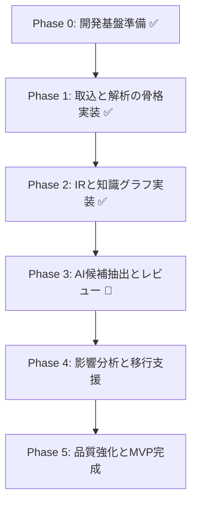

# レガシーコード考古学 ToDoリスト

- 文書番号：LCA-TODO-001
- 版数：1.2
- 作成日：2026-07-18
- 最終更新：2026-07-18（Phase 0 / Phase 1 / Phase 2 完了分を消し込み）

---

## 1. 目的

本リストは、「レガシーコード考古学」の実装開始に向けて、優先度と実行順を明確にした実務用ToDoを定義する。

---

## 2. 全体ロードマップ

---

## 3. Phase 0: 開発基盤準備 ✅ 完了

- [x] リポジトリ基本構成を確定する
- [x] 使用技術スタックを確定する（ADR-2026-003）
- [x] `.codex/rules/` を参照した開発フローを定義する
- [x] CIの最小構成を整備する（GitHub Actions）
- [x] フォーマッタ、リンタ、テストランナーを整備する（Spotless / JUnit5）
- [x] 環境変数・秘密情報管理方式を決定する（`.env.example` / Secret template）
- [x] ADR運用を開始する（ADR-2026-001〜003）

---

## 4. Phase 1: 取込と解析の骨格実装 ✅ 完了

- [x] Project管理APIを実装する（`ProjectController` / `CreateProjectUseCase`）
- [x] Asset取込APIを実装する（`IngestAssetUseCase` / `AssetEntity`）
- [x] Job管理APIを実装する（`JobController` / `SubmitAnalysisJobUseCase`）
- [ ] Gitリポジトリ取込機能を実装する（Phase 1.5 へ持ち越し）
- [ ] ファイルアップロード取込機能を実装する（Phase 1.5 へ持ち越し）
- [x] Java Parserの初版を実装する（`JavaSourceParser`）
- [x] Camel Route Parserの初版を実装する（`CamelRouteParser`）
- [x] SQL DDL Parserの初版を実装する（`SqlDdlParser`）
- [x] application.properties / YAML parserを実装する（`YamlConfigParser`）
- [x] 解析ジョブの非同期実行基盤を実装する（`AnalysisJobEntity` / `JobStatus` / `JobType`）

---

## 5. Phase 2: IRと知識グラフ実装 ✅ 完了

- [x] IRスキーマを確定する（`ProgramIr` / `RouteIr` / `TableIr` / `RelationIr`）
- [x] ProgramIr / RouteIr / RelationIr を実装する
- [x] IR保存方式を実装する（`IrMapper`）
- [x] Graph Mapperを実装する（`IrMapper` → `GraphSyncService`）
- [x] Graph DB初期スキーマを定義する（`ProgramNode` / `RouteNode` / `TableNode`）
- [x] Graph反映ジョブを実装する（`GraphSyncService` / Neo4j MERGE）
- [x] 差分再解析に必要なハッシュ・依存追跡を実装する（`versionHash` / `IngestAssetUseCase`）
- [x] 根拠リンク生成を実装する（`EvidenceEntity` / `business_rule_evidence_links`）

---

## 6. Phase 3: AI候補抽出とレビュー 🔄 進行中

- [ ] AI出力JSONスキーマを確定する
- [ ] プロンプト管理方式を実装する
- [ ] LLM呼び出しアダプタを実装する（Spring AI）
- [ ] 業務ルール候補抽出UseCaseを実装する
- [ ] 設計書と実装の不一致候補抽出UseCaseを実装する
- [x] Review APIを実装する（`BusinessRuleController` / `ReviewBusinessRuleUseCase`）
- [ ] Review UI初版を実装する
- [x] reviewStatus と confidence の状態遷移制御を実装する（`BusinessRuleEntity.approve/reject/putOnHold`）
- [x] AI実行ログ・監査ログを実装する（`AuditLogger` / `AuditLogEntity`）

---

## 7. Phase 4: 影響分析と移行支援

- [ ] 影響分析クエリを設計する（Neo4j Cypher）
- [ ] DBカラム変更影響分析を実装する
- [ ] API変更影響分析を実装する
- [ ] Route変更影響分析を実装する
- [ ] 関連テスト抽出を実装する
- [ ] OpenShift移行課題抽出ロジックを実装する
- [ ] モダナイゼーション候補生成UseCaseを実装する

---

## 8. Phase 5: 品質強化とMVP完成

- [ ] 解析結果検証テストを整備する
- [ ] 回帰テストデータセットを整備する
- [ ] セキュリティテストを実施する
- [ ] パフォーマンステストを実施する
- [ ] 文書一式を最新化する
- [ ] デモシナリオを作成する
- [ ] MVP完了判定レビューを実施する

---

## 9. 優先度Aの即着手項目

- [x] 技術スタック確定ADRを作成する（ADR-2026-003）
- [x] ディレクトリ構成を初期化する（`src/main/java/com/legacy/archaeology/`）
- [x] Project / Asset / Job のドメインモデルを実装する
- [x] Java / Camel / SQL parserのPoCを作成する
- [x] IRスキーマの草案をコード化する（`ProgramIr` / `RouteIr` / `TableIr` / `RelationIr`）
- [ ] Graph DB候補比較メモを作成する（Neo4j採用済みだが比較記録未作成）
- [x] Review状態遷移のテストを先に作成する（`BusinessRuleEntityTest`）

---

## 10. 優先度Bの短期項目

- [ ] PDF / Markdown文書解析を実装する
- [x] EvidenceEntityの保存方式を実装する（`EvidenceEntity` / `EvidenceRepository`）
- [ ] AIプロンプト版管理を実装する
- [ ] Graph探索APIを実装する
- [ ] 影響分析UIを実装する

---

## 11. 優先度Cの後続項目

- [ ] ログ解析の高度化
- [ ] Kafka導入の必要性再評価
- [ ] C/C++解析拡張
- [x] OpenShift配備テンプレート整備（`deploy/openshift/base/` 完了）
- [ ] SaaS運用設計の詳細化

---

## 12. 完了判定チェック

- [x] コードが存在する（Phase 0〜2 実装済み）
- [x] テストが存在する（8ファイル / 15ケース以上）
- [x] 監査観点が実装されている（`AuditLogger` / `AuditLogEntity`）
- [ ] ルール準拠レビューが完了している（Phase 3以降で実施）
- [ ] 文書が更新されている（本リスト更新済み / その他は Phase 5 で一括更新）
- [ ] MVPデモが可能である（Phase 5 完了時）

---

## 13. 実装済みファイル一覧（参考）

### ドメイン層
- `domain/projects/` : `ProjectEntity` / `ProjectRepository` / `ProjectStatus`
- `domain/assets/` : `AssetEntity` / `AssetRepository` / `AssetType`
- `domain/analysis/` : `AnalysisJobEntity` / `AnalysisJobRepository` / `JobStatus` / `JobType`
- `domain/knowledge/` : `BusinessRuleEntity` / `BusinessRuleRepository` / `ConfidenceLevel` / `ReviewStatus` / `EvidenceEntity` / `EvidenceRepository`
- `domain/reviews/` : `ReviewEntity` / `ReviewRepository`

### アプリケーション層
- `application/usecases/` : `CreateProjectUseCase` / `IngestAssetUseCase` / `SubmitAnalysisJobUseCase` / `ReviewBusinessRuleUseCase`
- `application/dto/` : `ProjectDto` / `AssetDto` / `JobDto` / `BusinessRuleDto` / `ReviewDto` / `ErrorDto`

### インフラ層
- `infrastructure/parser/` : `JavaSourceParser` / `CamelRouteParser` / `SqlDdlParser` / `YamlConfigParser`
- `infrastructure/ir/` : `ProgramIr` / `RouteIr` / `TableIr` / `RelationIr` / `IrMapper`
- `infrastructure/graph/` : `ProgramNode` / `RouteNode` / `TableNode` / `GraphSyncService`
- `infrastructure/config/` : `SecurityConfig`

### プレゼンテーション層
- `presentation/api/` : `ProjectController` / `JobController` / `BusinessRuleController` / `HealthController` / `GlobalExceptionHandler`

### 共有モジュール
- `shared/audit/` : `AuditLogEntity` / `AuditLogRepository` / `AuditLogger`
- `shared/id/` : `IdGenerator`
- `shared/logging/` : `TraceIdFilter`

### DBマイグレーション
- `V1__create_initial_tables.sql`（projects / assets / analysis_jobs / audit_logs）
- `V2__add_knowledge_tables.sql`（evidences / business_rules / business_rule_evidence_links / reviews）

### インフラ・CI
- `deploy/openshift/base/` : namespace / configmap / secret.template / deployment / service / route
- `.github/workflows/ci.yml`
- `docker-compose.yml`
- `Dockerfile`
