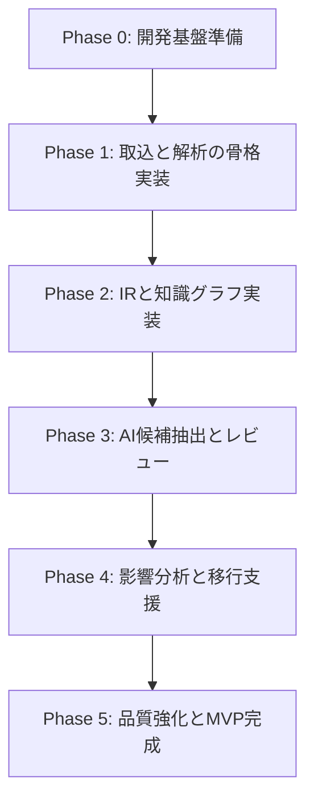

# レガシーコード考古学 ToDoリスト

- 文書番号：LCA-TODO-001
- 版数：1.0
- 作成日：2026-07-18

---

## 1. 目的

本リストは、「レガシーコード考古学」の実装開始に向けて、優先度と実行順を明確にした実務用ToDoを定義する。

---

## 2. 全体ロードマップ

---

## 3. Phase 0: 開発基盤準備

- [ ] リポジトリ基本構成を確定する
- [ ] 使用技術スタックを確定する
- [ ] `.codex/rules/` を参照した開発フローを定義する
- [ ] CIの最小構成を整備する
- [ ] フォーマッタ、リンタ、テストランナーを整備する
- [ ] 環境変数・秘密情報管理方式を決定する
- [ ] ADR運用を開始する

---

## 4. Phase 1: 取込と解析の骨格実装

- [ ] Project管理APIを実装する
- [ ] Asset取込APIを実装する
- [ ] Job管理APIを実装する
- [ ] Gitリポジトリ取込機能を実装する
- [ ] ファイルアップロード取込機能を実装する
- [ ] Java Parserの初版を実装する
- [ ] Camel Route Parserの初版を実装する
- [ ] SQL DDL Parserの初版を実装する
- [ ] application.properties / YAML parserを実装する
- [ ] 解析ジョブの非同期実行基盤を実装する

---

## 5. Phase 2: IRと知識グラフ実装

- [ ] IRスキーマを確定する
- [ ] ProgramIr / RouteIr / RelationIr を実装する
- [ ] IR保存方式を実装する
- [ ] Graph Mapperを実装する
- [ ] Graph DB初期スキーマを定義する
- [ ] Graph反映ジョブを実装する
- [ ] 差分再解析に必要なハッシュ・依存追跡を実装する
- [ ] 根拠リンク生成を実装する

---

## 6. Phase 3: AI候補抽出とレビュー

- [ ] AI出力JSONスキーマを確定する
- [ ] プロンプト管理方式を実装する
- [ ] LLM呼び出しアダプタを実装する
- [ ] 業務ルール候補抽出UseCaseを実装する
- [ ] 設計書と実装の不一致候補抽出UseCaseを実装する
- [ ] Review APIを実装する
- [ ] Review UI初版を実装する
- [ ] reviewStatus と confidence の状態遷移制御を実装する
- [ ] AI実行ログ・監査ログを実装する

---

## 7. Phase 4: 影響分析と移行支援

- [ ] 影響分析クエリを設計する
- [ ] DBカラム変更影響分析を実装する
- [ ] API変更影響分析を実装する
- [ ] Route変更影響分析を実装する
- [ ] 関連テスト抽出を実装する
- [ ] OpenShift移行課題抽出ロジックを実装する
- [ ] モダナイゼーション候補生成UseCaseを実装する

---

## 8. Phase 5: 品質強化とMVP完成

- [ ] 解析結果検証テストを整備する
- [ ] 回帰テストデータセットを整備する
- [ ] セキュリティテストを実施する
- [ ] パフォーマンステストを実施する
- [ ] 文書一式を最新化する
- [ ] デモシナリオを作成する
- [ ] MVP完了判定レビューを実施する

---

## 9. 優先度Aの即着手項目

- [ ] 技術スタック確定ADRを作成する
- [ ] ディレクトリ構成を初期化する
- [ ] Project / Asset / Job のドメインモデルを実装する
- [ ] Java / Camel / SQL parserのPoCを作成する
- [ ] IRスキーマの草案をコード化する
- [ ] Graph DB候補比較メモを作成する
- [ ] Review状態遷移のテストを先に作成する

---

## 10. 優先度Bの短期項目

- [ ] PDF / Markdown文書解析を実装する
- [ ] EvidenceEntityの保存方式を実装する
- [ ] AIプロンプト版管理を実装する
- [ ] Graph探索APIを実装する
- [ ] 影響分析UIを実装する

---

## 11. 優先度Cの後続項目

- [ ] ログ解析の高度化
- [ ] Kafka導入の必要性再評価
- [ ] C/C++解析拡張
- [ ] OpenShift配備テンプレート整備
- [ ] SaaS運用設計の詳細化

---

## 12. 完了判定チェック

- [ ] コードが存在する
- [ ] テストが存在する
- [ ] 監査観点が実装されている
- [ ] ルール準拠レビューが完了している
- [ ] 文書が更新されている
- [ ] MVPデモが可能である
