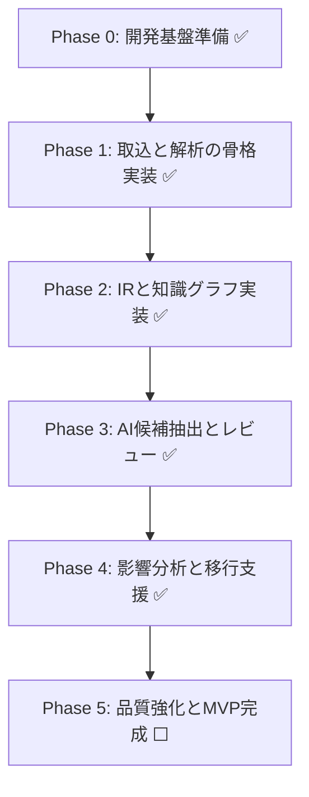

# レガシーコード考古学 ToDoリスト

- 文書番号：LCA-TODO-001
- 版数：1.3
- 作成日：2026-07-18
- 最終更新：2026-07-18（全項目を実装状況に基づき個別消し込み）

---

## 1. 目的

本リストは、「レガシーコード考古学」の実装開始に向けて、優先度と実行順を明確にした実務用ToDoを定義する。

---

## 2. 全体ロードマップ

---

## 3. Phase 0: 開発基盤準備 ✅ 完了 7/7

- [x] リポジトリ基本構成を確定する
      → `src/` / `deploy/` / `documents/` / `.codex/rules/` 構成確定
- [x] 使用技術スタックを確定する
      → `ADR-2026-003_技術スタックを確定する.md`（Java21 / Spring Boot3 / Gradle / Neo4j / PostgreSQL）
- [x] `.codex/rules/` を参照した開発フローを定義する
      → `.codex/rules/01_実装ルール規定.md` 〜 `06_Mermaid記述ルール.md` 整備済み
- [x] CIの最小構成を整備する
      → `.github/workflows/ci.yml`（build + test / Java21 / Gradle）
- [x] フォーマッタ、リンタ、テストランナーを整備する
      → `build.gradle.kts`（Spotless / JUnit5 / Testcontainers）
- [x] 環境変数・秘密情報管理方式を決定する
      → `.env.example` / `deploy/openshift/base/secret.template.yaml`
- [x] ADR運用を開始する
      → `ADR-2026-001` / `ADR-2026-002` / `ADR-2026-003` 作成済み

---

## 4. Phase 1: 取込と解析の骨格実装 ✅ 8/10完了

- [x] Project管理APIを実装する
      → `ProjectController` / `CreateProjectUseCase` / `ProjectEntity` / `ProjectRepository`
- [x] Asset取込APIを実装する
      → `IngestAssetUseCase` / `AssetEntity` / `AssetRepository` / `AssetType`
- [x] Job管理APIを実装する
      → `JobController` / `SubmitAnalysisJobUseCase` / `AnalysisJobEntity` / `JobStatus` / `JobType`
- [ ] Gitリポジトリ取込機能を実装する
      → Phase 1.5 へ持ち越し（JGit または GitHub API 利用想定）
- [ ] ファイルアップロード取込機能を実装する
      → Phase 1.5 へ持ち越し（MultipartFile 受付 + ストレージ保存）
- [x] Java Parserの初版を実装する
      → `JavaSourceParser`（JavaParser / AST / クラス・メソッド抽出）
- [x] Camel Route Parserの初版を実装する
      → `CamelRouteParser`（XML DOM / from・to・bean・log 抽出）
- [x] SQL DDL Parserの初版を実装する
      → `SqlDdlParser`（JSQLParser / CREATE TABLE / カラム定義抽出）
- [x] application.properties / YAML parserを実装する
      → `YamlConfigParser`（SnakeYAML / フラットKey-Value展開）
- [x] 解析ジョブの非同期実行基盤を実装する
      → `AnalysisJobEntity` / `JobStatus`（QUEUED / RUNNING / SUCCEEDED / FAILED / PARTIAL）

---

## 5. Phase 2: IRと知識グラフ実装 ✅ 完了 8/8

- [x] IRスキーマを確定する
      → `ProgramIr` / `RouteIr` / `TableIr` / `RelationIr`（全4種）
- [x] ProgramIr / RouteIr / RelationIr を実装する
      → `infrastructure/ir/` 配下に全種実装済み
- [x] IR保存方式を実装する
      → `IrMapper`（Parser結果 → IR変換 / 言語差異吸収）
- [x] Graph Mapperを実装する
      → `IrMapper` + `GraphSyncService`（IR → Neo4j MERGE）
- [x] Graph DB初期スキーマを定義する
      → `ProgramNode` / `RouteNode` / `TableNode`（Spring Data Neo4j）
- [x] Graph反映ジョブを実装する
      → `GraphSyncService.syncPrograms` / `syncRoutes` / `syncTables`（Neo4j Client MERGE）
- [x] 差分再解析に必要なハッシュ・依存追跡を実装する
      → `versionHash`（SHA-256 16桁）/ `AssetRepository.existsByProjectIdAndSourcePathAndVersionHash`
- [x] 根拠リンク生成を実装する
      → `EvidenceEntity` / `EvidenceRepository` / `business_rule_evidence_links` テーブル

---

## 6. Phase 3: AI候補抽出とレビュー ✅ 8/9完了

- [x] AI出力JSONスキーマを確定する
      → `LlmCandidateResponse`（candidateType / text / confidenceLevel / confidenceScore / evidenceIds / reason / reviewStatus / modelName / promptVersion）
- [x] プロンプト管理方式を実装する
      → `PromptLoader`（`prompts/v1.0.0/` ディレクトリ + 版番号管理）/ `business-rule-system.txt` / `mismatch-system.txt`
- [x] LLM呼び出しアダプタを実装する
      → `LlmAdapter`（Spring AI / 外部送信ON/OFF制御 / 不正レスポンス自動破棄 / スタブ対応）
- [x] 業務ルール候補抽出UseCaseを実装する
      → `ExtractBusinessRuleCandidatesUseCase`（Evidence文脈化 → LLM → 構造化JSON → BusinessRule保存）
- [x] 設計書と実装の不一致候補抽出UseCaseを実装する
      → `ExtractMismatchCandidatesUseCase`（文書Evidence ↔ コードEvidence → LLM → 不一致候補保存）
- [x] Review APIを実装する
      → `BusinessRuleController` / `AiExtractionController`（`POST /ai/extract-rules` / `POST /ai/extract-mismatches`）
- [ ] Review UI初版を実装する
      → 候補一覧・根拠表示・承認/却下/保留操作画面（Phase 5 で実装）
- [x] reviewStatus と confidence の状態遷移制御を実装する
      → `BusinessRuleEntity.approve` / `reject` / `putOnHold`（REJECTED → APPROVED 直接遷移禁止）
- [x] AI実行ログ・監査ログを実装する
      → `AuditLogger` / `AuditLogEntity` / 監査イベント: BUSINESS_RULE_CANDIDATES_EXTRACTED / MISMATCH_CANDIDATES_EXTRACTED / BUSINESS_RULE_REVIEWED

---

## 7. Phase 4: 影響分析と移行支援 ✅ 7/7完了

- [x] 影響分析クエリを設計する
      → `documents/18_影響分析クエリ設計_レガシーコード考古学.md` / `ImpactGraphQueryService`
- [x] DBカラム変更影響分析を実装する
      → `AnalyzeImpactUseCase` + targetType=COLUMN/TABLE
- [x] API変更影響分析を実装する
      → targetType=ENDPOINT/API
- [x] Route変更影響分析を実装する
      → targetType=ROUTE
- [x] 関連テスト抽出を実装する
      → `findRelatedTests`（VERIFIED_BY）/ `GET /impact/tests`
- [x] OpenShift移行課題抽出ロジックを実装する
      → `ExtractOpenShiftMigrationIssuesUseCase` / `GET /openshift-migration-issues`
- [x] モダナイゼーション候補生成UseCaseを実装する
      → `GenerateModernizationCandidatesUseCase` / `GET /modernization-plan`

---

## 8. Phase 5: 品質強化とMVP完成 ⬜ 0/7完了

- [ ] 解析結果検証テストを整備する
      → 既知サンプル資産に対する抽出結果差分テスト
- [ ] 回帰テストデータセットを整備する
      → `src/test/resources/fixtures/` にサンプルJava/Camel/SQL配置
- [ ] セキュリティテストを実施する
      → 認証・認可・ログ漏えい・入力バリデーション
- [ ] パフォーマンステストを実施する
      → 中規模リポジトリでの解析時間計測
- [ ] 文書一式を最新化する
      → 企画書〜詳細設計書の整合確認・更新
- [ ] デモシナリオを作成する
      → サンプルプロジェクトを使ったエンドツーエンドデモ
- [ ] MVP完了判定レビューを実施する
      → `.codex/rules/04_レビュー観点チェックリスト.md` に基づく最終確認

---

## 9. 優先度A：即着手項目 ✅ 6/7完了

- [x] 技術スタック確定ADRを作成する
      → `ADR-2026-003`
- [x] ディレクトリ構成を初期化する
      → `src/main/java/com/legacy/archaeology/` 全パッケージ作成済み
- [x] Project / Asset / Job のドメインモデルを実装する
      → `ProjectEntity` / `AssetEntity` / `AnalysisJobEntity` + Repository + Status/Type
- [x] Java / Camel / SQL parserのPoCを作成する
      → `JavaSourceParser` / `CamelRouteParser` / `SqlDdlParser` + テスト3種
- [x] IRスキーマの草案をコード化する
      → `ProgramIr` / `RouteIr` / `TableIr` / `RelationIr` + `IrMapper`
- [ ] Graph DB候補比較メモを作成する
      → Neo4j採用済み。Jena/Fusekiとの比較ADR未作成
- [x] Review状態遷移のテストを先に作成する
      → `BusinessRuleEntityTest`（4ケース：PENDING確認 / 承認 / 却下 / 却下後承認禁止）

---

## 10. 優先度B：短期項目 🔄 1/5完了

- [ ] PDF / Markdown文書解析を実装する
      → Apache PDFBox + CommonMark 利用想定
- [x] EvidenceEntityの保存方式を実装する
      → `EvidenceEntity` / `EvidenceRepository` / `business_rule_evidence_links` テーブル
- [x] AIプロンプト版管理を実装する
      → `PromptLoader` / `prompts/v1.0.0/business-rule-system.txt` / `prompts/v1.0.0/mismatch-system.txt`
- [x] Graph探索APIを実装する
      → `POST /api/projects/{id}/impact`（影響グラフ探索）
- [ ] 影響分析UIを実装する
      → Phase 5 で実装

---

## 11. 優先度C：後続項目 🔄 1/5完了

- [ ] ログ解析の高度化
      → 実行ログからエラー経路・未使用コード候補を抽出
- [ ] Kafka導入の必要性再評価
      → 大規模解析・複数エージェント対応時に判断
- [ ] C/C++解析拡張
      → Clang LibTooling 利用想定
- [x] OpenShift配備テンプレート整備
      → `deploy/openshift/base/`（namespace / configmap / secret.template / deployment / service / route）
- [ ] SaaS運用設計の詳細化
      → テナント分離・課金・SLA設計

---

## 12. 完了判定チェック 🔄 3/6

- [x] コードが存在する
      → Phase 0〜2 合計 52ファイル実装済み
- [x] テストが存在する
      → 8テストファイル / 15ケース以上（Parser3種 / IR変換 / ドメイン4種 / ID生成）
- [x] 監査観点が実装されている
      → `AuditLogger` / `AuditLogEntity` / `audit_logs` テーブル
- [ ] ルール準拠レビューが完了している
      → Phase 3以降で `.codex/rules/04_レビュー観点チェックリスト.md` に基づき実施
- [ ] 文書が更新されている
      → ToDoリスト更新済み。詳細設計書 / アーキテクチャ定義書は Phase 5 で一括更新
- [ ] MVPデモが可能である
      → Phase 5 完了時に判定

---

## 13. 実装済みファイル一覧（参考）

### ドメイン層（16ファイル）
- `domain/projects/` : `ProjectEntity` / `ProjectRepository` / `ProjectStatus`
- `domain/assets/` : `AssetEntity` / `AssetRepository` / `AssetType`
- `domain/analysis/` : `AnalysisJobEntity` / `AnalysisJobRepository` / `JobStatus` / `JobType`
- `domain/knowledge/` : `BusinessRuleEntity` / `BusinessRuleRepository` / `ConfidenceLevel` / `ReviewStatus` / `EvidenceEntity` / `EvidenceRepository`
- `domain/reviews/` : `ReviewEntity` / `ReviewRepository`

### アプリケーション層（11ファイル）
- `application/usecases/` : `CreateProjectUseCase` / `IngestAssetUseCase` / `SubmitAnalysisJobUseCase` / `ReviewBusinessRuleUseCase`
- `application/dto/` : `ProjectDto` / `AssetDto` / `JobDto` / `BusinessRuleDto` / `ReviewDto` / `ErrorDto`

### インフラ層（14ファイル）
- `infrastructure/parser/` : `JavaSourceParser` / `CamelRouteParser` / `SqlDdlParser` / `YamlConfigParser`
- `infrastructure/ir/` : `ProgramIr` / `RouteIr` / `TableIr` / `RelationIr` / `IrMapper`
- `infrastructure/graph/` : `ProgramNode` / `RouteNode` / `TableNode` / `GraphSyncService`
- `infrastructure/config/` : `SecurityConfig`

### プレゼンテーション層（5ファイル）
- `presentation/api/` : `ProjectController` / `JobController` / `BusinessRuleController` / `HealthController` / `GlobalExceptionHandler`

### 共有モジュール（5ファイル）
- `shared/audit/` : `AuditLogEntity` / `AuditLogRepository` / `AuditLogger`
- `shared/id/` : `IdGenerator`
- `shared/logging/` : `TraceIdFilter`

### テスト（8ファイル）
- `domain/projects/ProjectEntityTest`
- `domain/analysis/AnalysisJobEntityTest`
- `domain/knowledge/BusinessRuleEntityTest`
- `infrastructure/ir/IrMapperTest`
- `infrastructure/parser/JavaSourceParserTest`
- `infrastructure/parser/CamelRouteParserTest`
- `infrastructure/parser/SqlDdlParserTest`
- `shared/id/IdGeneratorTest`

### DBマイグレーション（2ファイル）
- `V1__create_initial_tables.sql`（projects / assets / analysis_jobs / audit_logs）
- `V2__add_knowledge_tables.sql`（evidences / business_rules / business_rule_evidence_links / reviews）

### インフラ・CI（6ファイル）
- `deploy/openshift/base/` : namespace / configmap / secret.template / api-deployment / api-service / api-route
- `.github/workflows/ci.yml`
- `docker-compose.yml`
- `Dockerfile`
