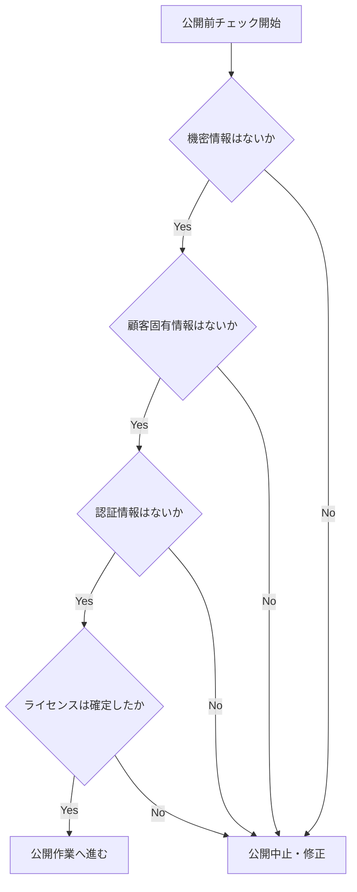

# GitHub公開手順書

- 文書番号：LCA-GH-001
- 版数：1.0
- 作成日：2026-07-18

---

## 1. 目的

本書は、「レガシーコード考古学」リポジトリを GitHub 上へ Public リポジトリとして公開するための手順を定義する。

---

## 2. 公開前チェック

以下を確認すること。

- 機密情報が含まれていない
- 顧客固有情報が含まれていない
- 認証情報、秘密鍵、`.env` が含まれていない
- 社内限定前提の文言が公開可能な内容になっている
- ライセンス方針が確定している



---

## 3. GitHub公開手順

### 3.1 Git初期化

```bash
git init
git add .
git commit -m "Initialize legacy-code-archaeology repository"
```

### 3.2 GitHubでPublicリポジトリ作成

推奨リポジトリ名：

- `legacy-code-archaeology`

### 3.3 リモート設定

SSH の場合：

```bash
git remote add origin git@github.com:<YOUR_ACCOUNT>/legacy-code-archaeology.git
```

HTTPS の場合：

```bash
git remote add origin https://github.com/<YOUR_ACCOUNT>/legacy-code-archaeology.git
```

### 3.4 Push

```bash
git branch -M main
git push -u origin main
```

---

## 4. 公開後チェック

- GitHub 上で README が正しく表示される
- Mermaid 図が表示される
- `documents/` の文書が参照できる
- `.codex/rules/` のルールが参照できる
- `LICENSE` が認識される
- 不要ファイルが含まれていない

---

## 5. About設定例

### Repository description

Evidence-first platform concept for recovering business knowledge from legacy systems.

### Website

必要に応じて未設定

### Topics

- legacy
- modernization
- architecture
- knowledge-graph
- reverse-engineering
- documentation
- ai
- openshift
- camel
- java

---

## 6. 公開後に推奨する次アクション

- GitHub Issues を有効化する
- Projects を有効化する
- MVP向け Issue を ToDo リストから起票する
- ADR更新フローを Pull Request に組み込む
- CI を追加する
