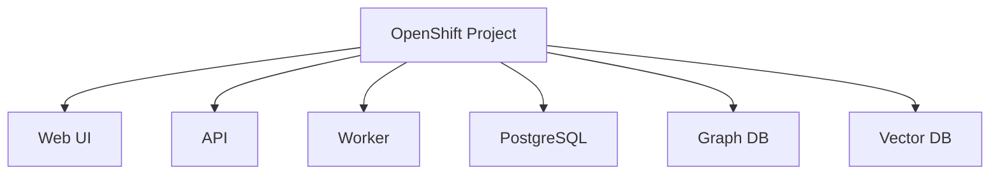

# OpenShiftデプロイ方針

- 文書番号：LCA-OCP-001
- 版数：1.0
- 作成日：2026-07-18

---

## 1. 目的

本書は、「レガシーコード考古学」を OpenShift へ配備する際の基本方針、運用ルール、およびコマンド実行上の前提を定義する。

---

## 2. コンテナ実行環境の方針

| 環境 | 使用ツール | 備考 |
|---|---|---|
| ローカル開発 | **Podman** | Docker 使用禁止（ADR-2026-004）|
| ローカルコンテナ起動 | `podman compose` | `podman-compose.yml` を使用 |
| イメージビルド | `podman build` | `docker build` は使用しない |
| 本番デプロイ | `oc apply` | OpenShift への配備 |

### ローカル起動手順

```bash
source ~/.bash_profile

# 起動
podman compose -f podman-compose.yml up -d

# または
./scripts/local/start.sh

# 停止
./scripts/local/stop.sh

# イメージビルド
./scripts/local/build.sh
```

---

## 3. 基本方針

- OpenShift は本システムの標準実行基盤候補とする
- API、Worker、Web UI、DB、Graph DB、Vector DB は責務ごとに分離する
- 秘密情報は Git に含めず、Secret または外部 Secret Manager で管理する
- 配備前に Shell 実行環境を初期化する



---

## 4. Shell実行ルール

OpenShift 関連コマンドを実行する前に、以下を先に実行すること。

```bash
source ~/.bash_profile
```

その後で `oc` コマンドを実行する。

例：

```bash
source ~/.bash_profile
oc version --client
source ~/.bash_profile
oc login --token=<TOKEN> --server=<SERVER>
```

### 理由

- `oc` が PATH に通っていないケースを防ぐため
- 開発端末ごとの差異を減らすため
- `.bash_profile` に定義された認証補助・ツール設定を確実に反映するため

---

## 5. Namespace作成手順例

```bash
source ~/.bash_profile
oc login --token=<TOKEN> --server=<SERVER>
source ~/.bash_profile
oc new-project legacy-code-archaeology-dev
```

---

## 6. デプロイ手順例

```bash
source ~/.bash_profile
oc project legacy-code-archaeology-dev
source ~/.bash_profile
oc apply -f deploy/openshift/base/
```

---

## 7. セキュリティ注意事項

- Token はチャット、Git、文書に保存しない
- Secret は template のみをリポジトリに保存する
- 本番と検証で Namespace を分離する
- RBAC と監査ログを有効化する

---

## 8. 今後の整備対象

- `deploy/openshift/` 配下の manifest 一式
- API / Worker / Web UI の Deployment 定義
- Route / Service / ConfigMap / Secret template
- デプロイスクリプト
- CI/CD 連携
