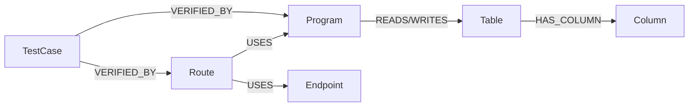

# 影響分析クエリ設計

- 文書番号：LCA-IMPACT-001
- 版数：1.0
- 作成日：2026-07-18

---

## 1. 目的

知識グラフ上の依存関係を辿り、変更対象の影響範囲を説明可能な形で返す。

---

## 2. ノード / エッジ

### ノード
- `Program`
- `Route`
- `Table`
- `Column`
- `Endpoint`
- `TestCase`
- `ConfigKey`

### エッジ
- `HAS_COLUMN` : Table → Column
- `RELATION {type}` : CALLS / READS / WRITES / USES / IMPLEMENTS / VERIFIED_BY / EXPOSES / CONSUMES



---

## 3. 基本探索方針

1. 起点ノードを `targetType` + `targetId` または `name` で特定
2. 双方向に最大 `maxDepth`（既定 3）まで探索
3. 到達ノードを影響候補として返す
4. 経路上の関係種別から影響レベルを算出
5. `VERIFIED_BY` で関連テストを抽出
6. すべての結果に根拠（sourcePath / relationType / depth）を付与

---

## 4. 影響レベル

| レベル | 条件 |
|---|---|
| HIGH | WRITE / 直接依存 depth=1 |
| MEDIUM | READ / USES / CALLS depth<=2 |
| LOW | 間接依存 depth>=3 |
| UNKNOWN | 関係種別不明 |

---

## 5. 代表 Cypher

### 5.1 汎用影響探索

```cypher
MATCH (start)
WHERE start.id = $targetId AND start.projectId = $projectId
MATCH path = (start)-[*1..$maxDepth]-(affected)
WHERE affected.projectId = $projectId
RETURN DISTINCT
  labels(affected)[0] AS nodeType,
  affected.id AS nodeId,
  coalesce(affected.className, affected.routeId, affected.tableName, affected.name, affected.id) AS name,
  length(path) AS depth,
  [r IN relationships(path) | type(r) + coalesce(':' + r.type, '')] AS relationPath,
  coalesce(affected.sourcePath, '') AS sourcePath
ORDER BY depth, nodeType, name
LIMIT 200
```

### 5.2 DBカラム起点

```cypher
MATCH (c:Column)
WHERE c.projectId = $projectId AND (c.id = $targetId OR c.name = $targetName)
OPTIONAL MATCH (t:Table)-[:HAS_COLUMN]->(c)
OPTIONAL MATCH path = (c)-[*1..3]-(affected)
RETURN c, t, collect(DISTINCT affected) AS impacted
```

### 5.3 Route起点

```cypher
MATCH (r:Route {projectId: $projectId})
WHERE r.id = $targetId OR r.routeId = $targetName
MATCH path = (r)-[*1..3]-(affected)
RETURN r, collect(DISTINCT affected) AS impacted
```

### 5.4 関連テスト

```cypher
MATCH (start)
WHERE start.id = $targetId AND start.projectId = $projectId
MATCH (start)-[*0..3]-(n)
MATCH (t:TestCase)-[v:RELATION {type:'VERIFIED_BY'}]->(n)
RETURN DISTINCT t
```

---

## 6. OpenShift移行課題の抽出観点

- `localhost` / 固定IP 接続
- ローカルファイルパス依存
- 特権ポート / hostNetwork 相当設定
- 状態を持つルート（ファイル書き込み）
- 外部SOAP/JMS の直結
- 設定ハードコード

---

## 7. モダナイゼーション候補

| 候補 | 条件例 |
|---|---|
| 維持 | 依存が少なく利用中 |
| 廃止 | 参照ゼロ |
| 再設計 | 高結合・多段依存 |
| API化 | Route/Program が同期連携中心 |
| イベント化 | バッチ的・非同期化余地あり |
