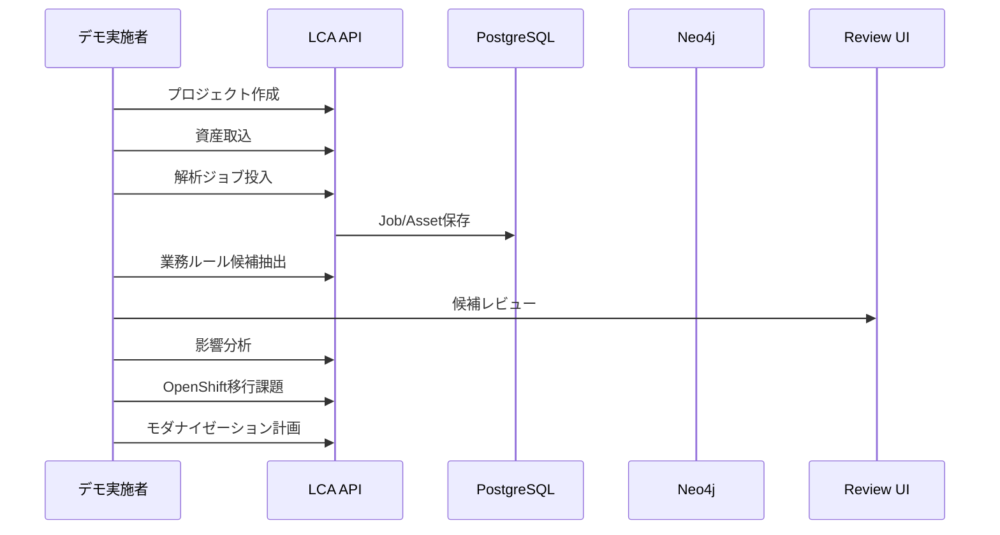

# デモシナリオ（MVP）

- 文書番号：LCA-DEMO-001
- 版数：1.0
- 作成日：2026-07-18

---

## 1. 目的

MVPの価値を、エンドツーエンドで説明可能なデモ手順として固定する。

---

## 2. 前提

- API が起動していること（ローカルまたは OpenShift）
- ローカルDBは Podman で起動

```bash
source ~/.bash_profile
./scripts/local/start.sh
./gradlew bootRun
```

OpenShift の場合:

```text
https://lca-api-route-legacy-code-archaeology-dev.apps.cluster-9nq5p.dyn.redhatworkshops.io
```

---

## 3. デモの流れ



---

## 4. 手順

### 4.1 ヘルス確認

```bash
curl -s http://localhost:8080/api/health
```

### 4.2 プロジェクト作成

```bash
curl -s -X POST http://localhost:8080/api/projects \
  -H 'Content-Type: application/json' \
  -d '{"name":"demo-customer-platform","description":"MVPデモ"}'
```

返却された `projectId` を控える。

### 4.3 資産取込

```bash
curl -s -X POST http://localhost:8080/api/projects/{projectId}/ingest \
  -H 'Content-Type: application/json' \
  -d '{"assetType":"JAVA_SOURCE","sourcePath":"fixtures/java/CustomerRegistrationService.java"}'
```

### 4.4 解析ジョブ

```bash
curl -s -X POST http://localhost:8080/api/projects/{projectId}/analyze \
  -H 'Content-Type: application/json' \
  -d '{"jobType":"STATIC_ANALYSIS","forceFullReanalysis":false}'
```

### 4.5 業務ルール候補抽出

```bash
curl -s -X POST http://localhost:8080/api/projects/{projectId}/ai/extract-rules
```

### 4.6 レビューUI

ブラウザで開く:

```text
http://localhost:8080/review/
```

1. Project ID を入力
2. 候補を読み込み
3. 根拠（evidenceIds）を確認
4. 承認 / 却下 / 保留

### 4.7 影響分析

```bash
curl -s -X POST http://localhost:8080/api/projects/{projectId}/impact \
  -H 'Content-Type: application/json' \
  -d '{"targetType":"COLUMN","targetName":"customer_id","maxDepth":3}'
```

### 4.8 OpenShift移行課題

```bash
curl -s http://localhost:8080/api/projects/{projectId}/openshift-migration-issues
```

### 4.9 モダナイゼーション計画

```bash
curl -s http://localhost:8080/api/projects/{projectId}/modernization-plan
```

---

## 5. デモで強調するポイント

1. **コード変換ではなく業務知識復元**
2. **Evidence First**（evidenceIds / sourcePath）
3. **AIは候補、確定は人間レビュー**
4. **影響分析がグラフ根拠付き**
5. **OpenShift移行課題を先に可視化**

---

## 6. 成功条件

- Health が UP
- プロジェクト/取込/解析 API が応答
- ルール候補が `Pending` で作成される
- レビューで `Approved/Rejected` に遷移できる
- 影響分析・移行課題・近代化計画 API が応答する
