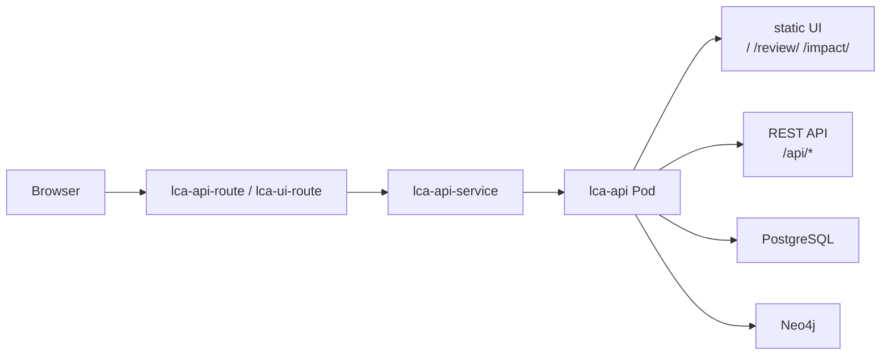

# OpenShift UI デプロイ説明

- 文書番号：LCA-OCP-UI-001
- 版数：1.0
- 作成日：2026-07-18

---

## 1. 現状の提供方式

MVP では **独立した frontend Deployment は持たない**。  
Web UI は `lca-api` と同じ Spring Boot アプリ内の静的コンテンツとして配信する。



---

## 2. 公開 URL

- Portal UI: `/`
- Review UI: `/review/`
- Impact UI: `/impact/`
- API Health: `/api/health`

例:

```text
https://lca-api-route-legacy-code-archaeology-dev.apps.cluster-9nq5p.dyn.redhatworkshops.io/
https://lca-api-route-legacy-code-archaeology-dev.apps.cluster-9nq5p.dyn.redhatworkshops.io/review/
https://lca-api-route-legacy-code-archaeology-dev.apps.cluster-9nq5p.dyn.redhatworkshops.io/impact/
```

---

## 3. デプロイ対象

| リソース | 役割 |
|---|---|
| `deployment/lca-api` | API + UI |
| `service/lca-api-service` | 内部公開 |
| `route/lca-api-route` | 外部公開（API/UI） |
| `route/lca-ui-route` | UI 明示用 Route（同一 Service） |

---

## 4. 今後の分離方針

本格 UI が必要になったら次を分離する。

1. `lca-web` Deployment（Nginx / Node）
2. `lca-web-service`
3. UI 専用 Route
4. API は CORS / SSO 連携

MVP では一体配信を維持し、運用とデプロイを単純化する。
