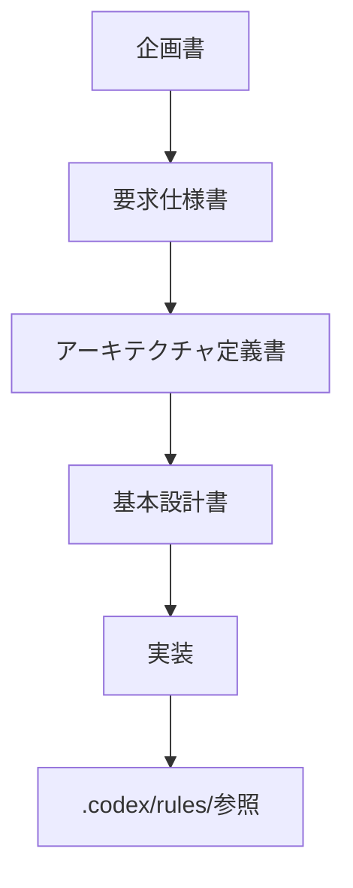

# documents ディレクトリ README

このディレクトリには、「レガシーコード考古学」に関する企画・要求・設計・補助文書を配置する。

## 文書一覧

1. `01_企画書_レガシーコード考古学.md`
2. `02_要求仕様書_レガシーコード考古学.md`
3. `03_アーキテクチャ定義書_レガシーコード考古学.md`
4. `04_基本設計書_レガシーコード考古学.md`
5. `11_ルール文書配置方針_レガシーコード考古学.md`
6. `12_詳細設計書_レガシーコード考古学.md`
7. `13_ToDoリスト_レガシーコード考古学.md`
8. `14_GitHub公開手順書_レガシーコード考古学.md`
9. `15_公開用リポジトリ説明文案_レガシーコード考古学.md`
10. `16_OpenShiftデプロイ方針_レガシーコード考古学.md`

## 正式ルールの参照先

実装・設計・AI利用・レビュー・Mermaid記述ルールは、以下を正本とする。

- `.codex/rules/README.md`
- `.codex/rules/01_実装ルール規定.md`
- `.codex/rules/02_コーディング規約.md`
- `.codex/rules/03_AI利用規程.md`
- `.codex/rules/04_レビュー観点チェックリスト.md`
- `.codex/rules/05_ADRテンプレート.md`
- `.codex/rules/06_Mermaid記述ルール.md`

## 推奨参照順序

## 運用方針

- `documents/` は企画・仕様・設計・補助説明文書を配置する
- 正式ルールは `.codex/rules/` を参照する
- 図・ダイアログ・フローは原則 Mermaid で記述する
- 重要な設計判断は ADR として記録する
